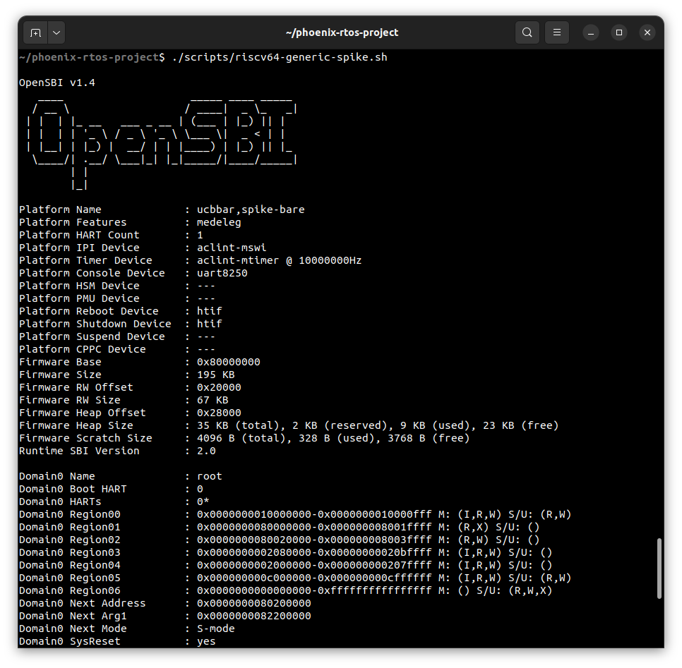
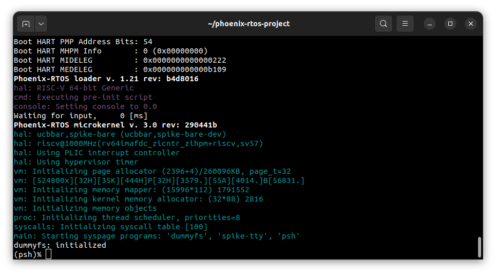

# Running system on <nobr>riscv64-generic-spike</nobr>

This version is designated for RISC-V 64 processors based spike machine implemented by the Spike (`riscv-isa-sim`)
emulator. To launch this version `feniks.osbi` file should be provided - system image with integrated OpenSBI
bootloader, containing PLO, kernel, console driver, dummyfs filesystem and the `psh` shell.

The file is created as the final artifact of the `feniks-rtos-project` build and is located in the `_boot` directory.
See [how to build the Feniks-RTOS system image](../building/index.md)

## Running image under the spike

Firstly, you need to install a spike simulator.

  <details>
  <summary>How to install spike simulator (Ubuntu 20.04)</summary>

  1. Clone the `riscv-isa-sim` GitHub repository. System was tested on commit `5fa1cd54` on `master` branch.

      ```console
      git clone https://github.com/riscv-software-src/riscv-isa-sim.git --single-branch
      ```

  2. Enter the downloaded repository

      ```console
      cd riscv-isa-sim
      ```

  3. Check out the commit `5fa1cd54`

      ```console
      git checkout 5fa1cd54
      ```

  4. Install the device-tree-compiler

      ```console
      sudo apt-get update && \
      sudo apt-get install device-tree-compiler
      ```

  5. Install the Spike RISC-V ISA Simulator

      ```console
      mkdir build && \
      cd build && \
      ../configure --prefix=$RISCV && \
      make && \
      sudo make install
      ```

  </details>
  </br>

Then, to run the image under spike you should change the directory to `feniks-rtos-project` and type:

```console
./scripts/riscv64-generic-spike.sh
```


</br>


## Using Feniks-RTOS

Feniks-RTOS will be launched and the `psh` shell command prompt will appear in the terminal. To get the available
command list please type:

```console
help
```


To get the list of working processes please type:

```console
ps
```


## See also

1. [Running system on targets](index.md)
2. [Table of Contents](../index.md)
