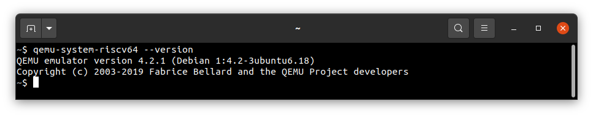
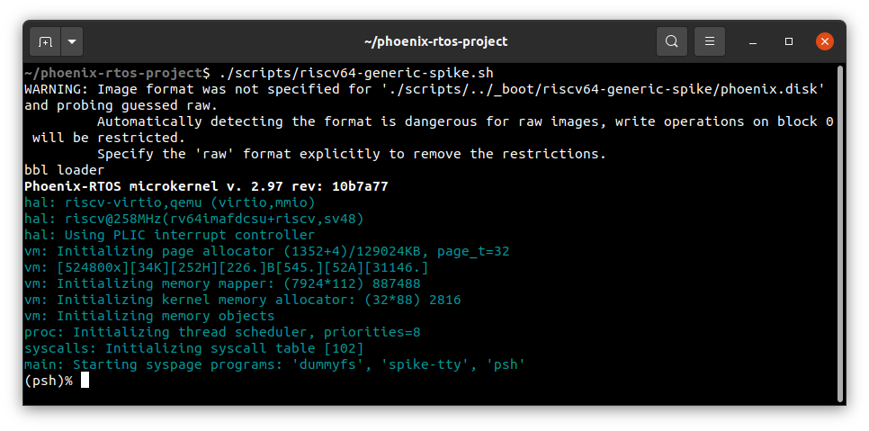
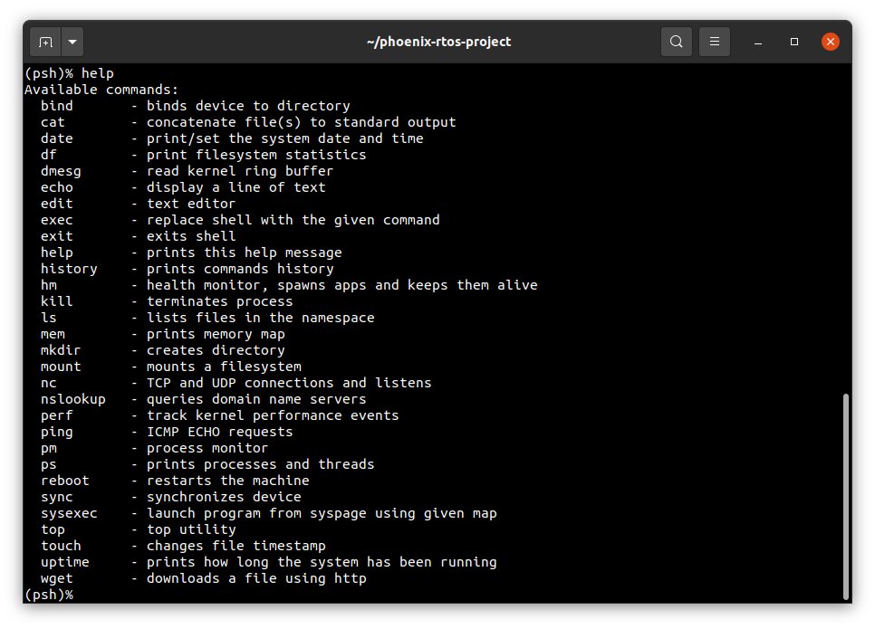
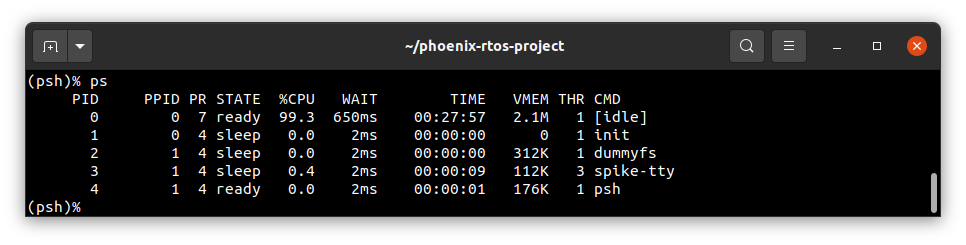

# Running system on `riscv64-generic-spike`

This version is designated for RISC-V 64 processors based spike machine implemented by the spike (riscv-isa-sim)
emulator and `qemu-system-riscv64`. To launch this version two files should be provided - kernel file integrated
with SBI firmware with embedded SBI console driver, dummyfs filesystem and `psh` shell, and disk image with ext2
filesystem.

The files are created as the final artifact of the `phoenix-rtos-project` building and are located in the `_boot`
directory. See [how to build the Phoenix-RTOS system image](../building/README.md)

## Running image under the spike

Firstly, you need to install a spike simulator.

  <details>
  <summary>How to install spike simulator (Ubuntu 20.04)</summary>

  1. Clone the riscv-isa-sim GitHub repository in a `1.1.0` version.

      ```bash
      git clone https://github.com/riscv-software-src/riscv-isa-sim.git --branch v1.1.0 --single-branch
      ```

  2. Enter the downloaded repository

      ```bash
      cd riscv-isa-sim
      ```

  3. Install the device-tree-compiler

      ```bash
      sudo apt-get update && \
      sudo apt-get install device-tree-compiler
      ```

  4. Install the Spike RISC-V ISA Simulator

      ```bash
      mkdir build && \
      cd build && \
      ../configure --prefix=$RISCV && \
      make && \
      sudo make install
      ```

  </details>
  </br>

Then, to run the image under spike you should change the directory to `phoenix-rtos-project` and type:

```bash
spike _boot/riscv64-generic-spike/phoenix.bbl
```


## Running image under QEMU

Just like before, you first need to install the emulator.

  <details>
  <summary>How to get QEMU (Ubuntu 20.04)</summary>

- Install the required packages

  ```bash
  sudo apt-get update && \
  sudo apt-get install qemu-kvm \
  qemu virt-manager \
  virt-viewer libvirt-clients \
  libvirt-daemon-system \
  bridge-utils virtinst \
  libvirt-daemon \
  qemu-system-misc
  ```

- Check if QEMU is properly installed:

  ```bash
  qemu-system-riscv64 --version
  ```

  

  </details>

  <details>
  <summary>How to get QEMU (macOS)</summary>

- Install the required packages

  ```zsh
  brew update && \
  brew install qemu
  ```

- Check if QEMU is properly installed:

  ```zsh
  qemu-system-riscv64 --version
  ```

  ```zsh
  ~$ qemu-system-riscv64 --version
  QEMU emulator version 8.0.0
  Copyright (c) 2003-2022 Fabrice Bellard and the QEMU Project developers
  ~$
  ```

  </details>

To run the system image under QEMU you should type the following command from the `phoenix-rtos-project` directory.

```bash
./scripts/riscv64-generic-spike.sh
```



## Using Phoenix-RTOS

Phoenix-RTOS will be launched and the `psh` shell command prompt will appear in the terminal. To get the available
command list please type:

```bash
help
```



To get the list of working processes please type:

```bash
ps
```



## See also

1. [Running system on targets](README.md)
2. [Table of Contents](../README.md)
