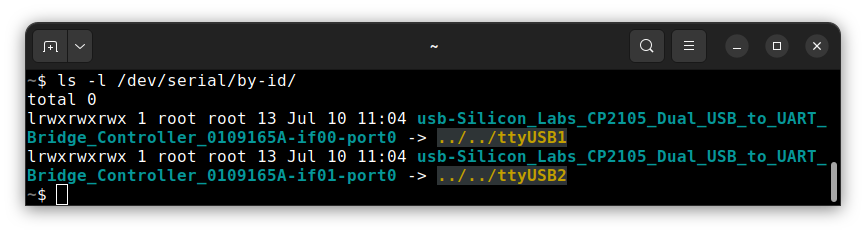
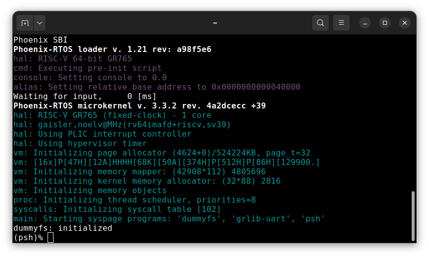

# Running system on <nobr>riscv64-gr765-vcu118</nobr>

These instructions describe how to run Phoenix-RTOS on the GR765 processor configured on the AMD Virtex UltraScale+
FPGA VCU118 board - `riscv64-gr765-vcu118` target. Note that the build artifacts, including the system image should be
provided in the `_boot` directory. If you have not built the system image yet, please refer to the
[Building Phoenix-RTOS image](../building/index.md) section.

## Connecting the board

Power on the board and connect it to the computer using 2 micro USB cables that provides JTAG and UART communication.

## Loading the Phoenix-RTOS system image

To load the Phoenix-RTOS system image to the board, you will need to use the `GRMON` debug monitor. Note that the
Professional version of the `GRMON` is required to run the system on the GR765 target.

<details>
<summary>How to get GRMON</summary>

- Download the GRMON software from the [official website](https://www.gaisler.com/products/grmon4).
- After downloading the archive, extract it and optionally add the `grmon` binary to the `PATH` variable.
- Install Digilent Adept Runtime for debug link connection as described in the
[GRMON User's Manual](https://download.gaisler.com/products/GRMON4/doc/grmon4.pdf).

</details>
</br>

Launch the `GRMON` monitor using the following command:

```shell
grmon -digilent
```

The `-digilent` parameter specifies the Digilent JTAG adapter.

Load the Phoenix-RTOS system image to the RAM by running the following commands in the `GRMON`:

```shell
load _boot/riscv64-gr765-vcu118/sbi-gr765.elf
```

```shell
load -binary _boot/riscv64-gr765-vcu118/phoenix.disk 0x10000000
```

Set entry point of the program:

```shell
ep 0x0
```

Check on which port the board is connected to the computer. To do this, run the following command:

```shell
ls -l /dev/serial/by-id
```



In this case, the serial port to use is `/dev/ttyUSB2`. Open the terminal emulator and connect to the board using the
following command:

```shell
picocom -b 115200 --imap lfcrlf /dev/ttyUSB2
```

To start the Phoenix-RTOS system, execute the following command in the `GRMON` monitor:

```shell
run
```

## Using the Phoenix-RTOS

After executing the `run` command, Phoenix-RTOS will be launched and the `psh` shell command prompt will appear in the
terminal.


