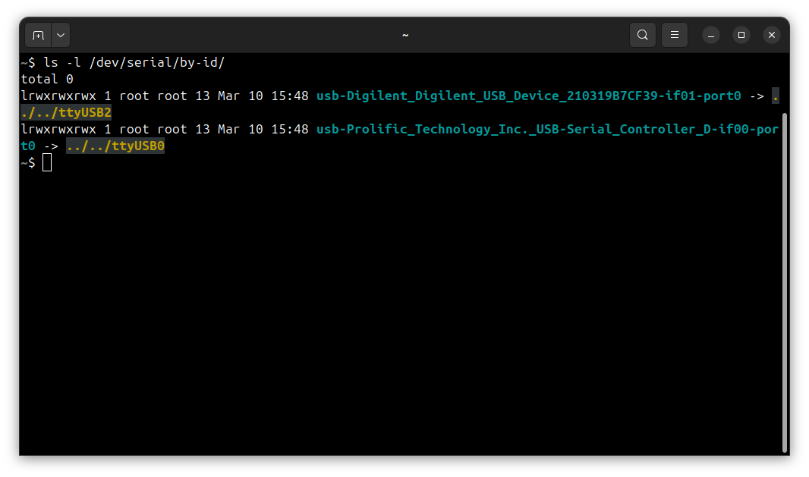
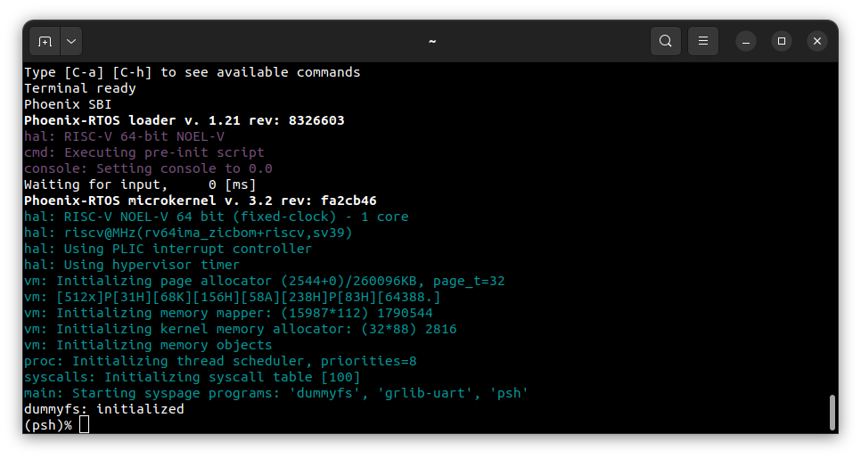

# Running system on <nobr>riscv64-noelv-fpga</nobr>

These instructions describe how to run Feniks-RTOS on the NOEL-V processor configured on the Digilent Arty A7-100T
FPGA - `riscv64-noelv-fpga` target. Note that the build artifacts, including the system image should be provided in the
`_boot` directory. If you have not built the system image yet, please refer to the
[Building Feniks-RTOS image](../building/index.md) section.

## Connecting the board

Connect the board to the computer using 1 micro USB cable that provides power and UART communication.

## Loading the Feniks-RTOS system image

To load the Feniks-RTOS system image to the board, you will need to use the `GRMON` debug monitor.

<details>
<summary>How to get GRMON</summary>

- Download the GRMON software from the [official website](https://www.gaisler.com/products/grmon4).
- After downloading the archive, extract it and optionally add the `grmon` binary to the `PATH` variable.
- Install Digilent Adept Runtime for debug link connection as described in the
[GRMON User's Manual](https://download.gaisler.com/products/GRMON4/doc/grmon4.pdf).

</details>
</br>

Launch the `GRMON` monitor using the following command:

```console
grmon -digilent
```

The `-digilent` parameter specifies the Digilent JTAG adapter.

Load the Feniks-RTOS system image to the RAM by running the following commands in the `GRMON`:

```console
load _boot/riscv64-noelv-fpga/sbi-noelv.elf
```

```console
load -binary _boot/riscv64-noelv-fpga/feniks.disk 0x08000000
```

Set entry point of the program:

```console
ep 0x0
```

Check on which port the board is connected to the computer. To do this, run the following command:

```console
ls -l /dev/serial/by-id
```



In this case, the serial port to use is `/dev/ttyUSB1`. Open the terminal emulator and connect to the board using the
following command:

```console
picocom -b 115200 --imap lfcrlf /dev/ttyUSB1
```

To start the Feniks-RTOS system, execute the following command in the `GRMON` monitor:

```console
run
```

## Using the Feniks-RTOS

After executing the `run` command, Feniks-RTOS will be launched and the `psh` shell command prompt will appear in the
terminal.



## See also

1. [Running system on targets](index.md)
2. [Table of Contents](../index.md)
