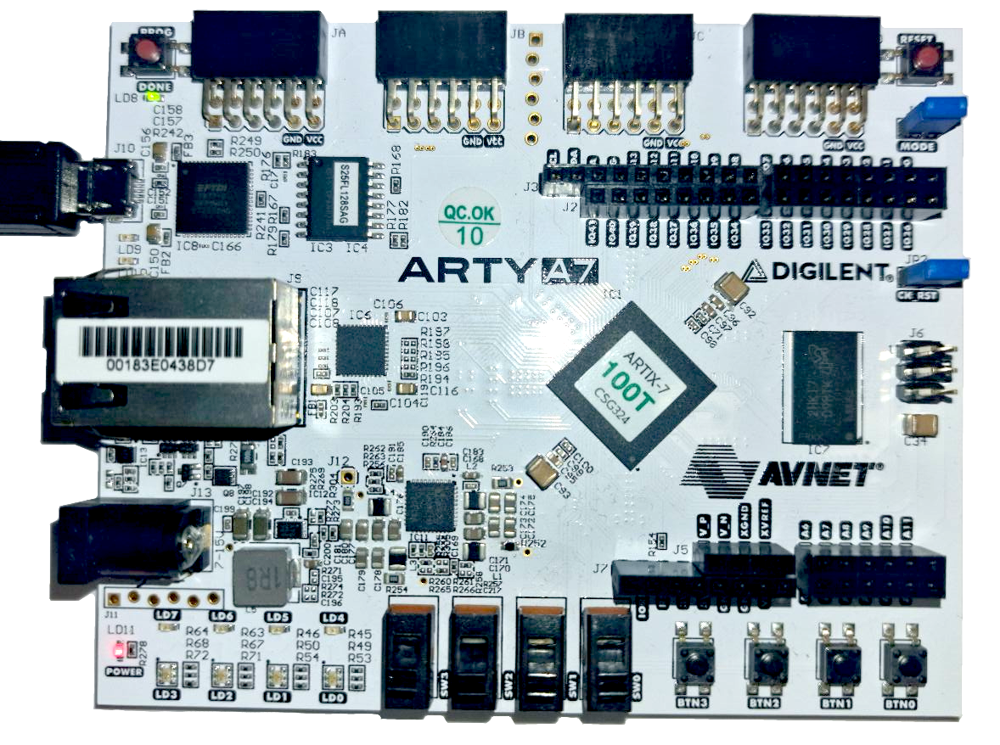
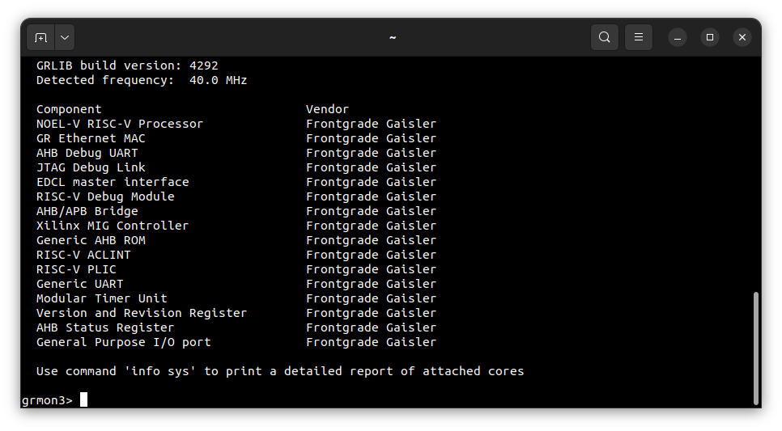
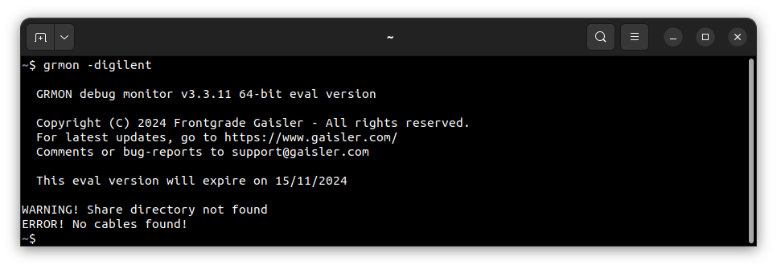
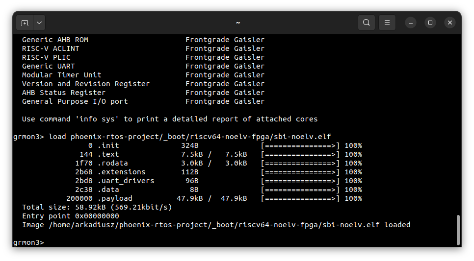
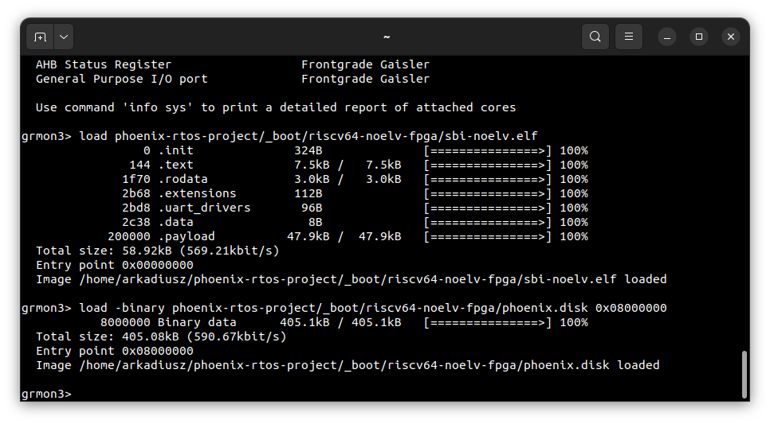
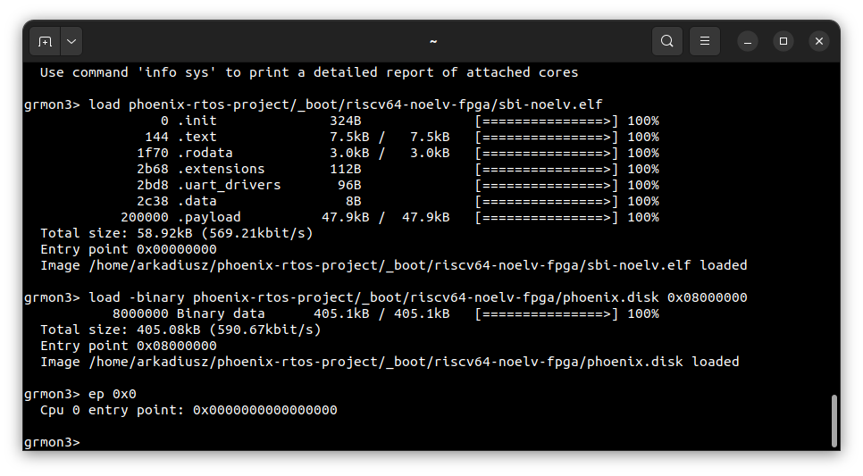
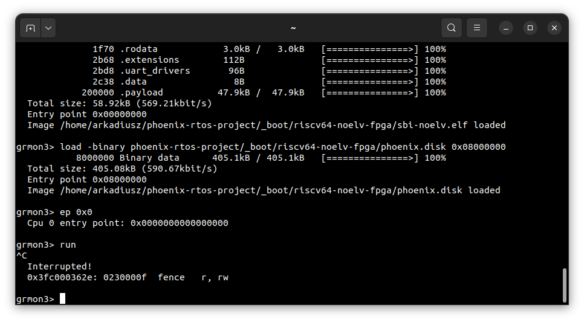

# Running system on <nobr>riscv64-noelv-fpga</nobr>

These instructions describe how to run Phoenix-RTOS on the NOEL-V processor configured on the Digilent Arty A7-100T
FPGA - `riscv64-noelv-fpga` target. Note that the build artifacts, including the system image should be provided in the
`_boot` directory. If you have not built the system image yet, please refer to the
[Building Phoenix-RTOS image](../building/index.md) section.

## Connecting the board

Connect the board to the computer using micro USB cable that provides power and UART communication, like on image
below:



## Loading the Phoenix-RTOS system image

To load the Phoenix-RTOS system image to the board, you will need to use the `GRMON` debug monitor.

<details>
<summary>How to get GRMON</summary>

- Download the GRMON software from the [official website](https://www.gaisler.com/index.php/downloads/debug-tools)

- After downloading the archive, extract it and optionally add the `grmon` binary to the `PATH` variable
(You can also copy its binary to `/bin` with sudo).

- Install Digilent Adept Runtime for debug link connection:

  - On Linux systems, the Digilent Adept2 Runtime must be installed on the host computer, which can be downloaded
  from Digilent's website.
  - More detailed information you can be found in the
  [GRMON User's Manual](https://www.gaisler.com/doc/grmon-eval/grmon3.pdf)
  & [Digilent Adept 2](https://digilent.com/reference/software/adept/start).

</details>
</br>

Launch the `GRMON` monitor using the following command:

```console
grmon -digilent
```

Note: The `-digilent` parameter specifies the Digilent JTAG adapter.

If the board is correctly plugged in and Adept2 is present on the system, grmon will display something similar to this:



In case of bad connection or problem with Adept2 you may get similar output:



Load the Phoenix-RTOS system image into the RAM by running the following commands in the `GRMON`:

- Load supervisor binary interface for RISC-V:

```console
load phoenix-rtos-project/_boot/riscv64-noelv-fpga/sbi-noelv.elf
```



- Load Phoenix-RTOS system:

```console
load -binary phoenix-rtos-project/_boot/riscv64-noelv-fpga/phoenix.disk 0x08000000
```



Determine entry point of the program:

```console
ep 0x0
```



Check on which port the board is connected to the computer. To do this, run the following command:

```console
ls -l /dev/serial/by-id
```


In this case, the serial port to use is `/dev/ttyUSB1`. Open the terminal emulator and connect to the board using the
following command:

```console
picocom -b 115200 --imap lfcrlf /dev/ttyUSB1
```

To start the Phoenix-RTOS system, execute the following command in the `GRMON` monitor:

```console
run
```

## Using the Phoenix-RTOS

After executing the `run` command, Phoenix-RTOS will be launched and the `psh` shell command prompt will appear in the
terminal.


Note: Keep in mind that it is necessary to have grmon running in background. In case of closing emulation via `detach`
or accidental terminating `run` command, it will shut down the connection with the board.
Grmon will inform you of such an event like or similar to this:



## See also

1. [Running system on targets](index.md)
2. [Table of Contents](../index.md)
