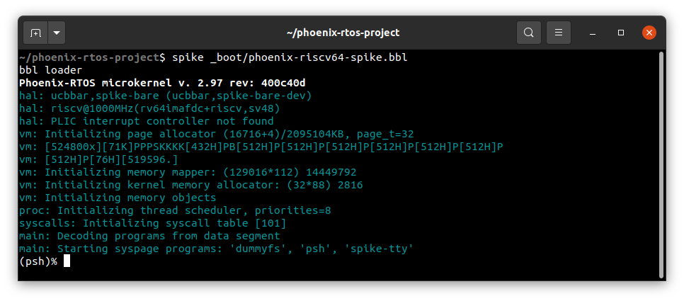
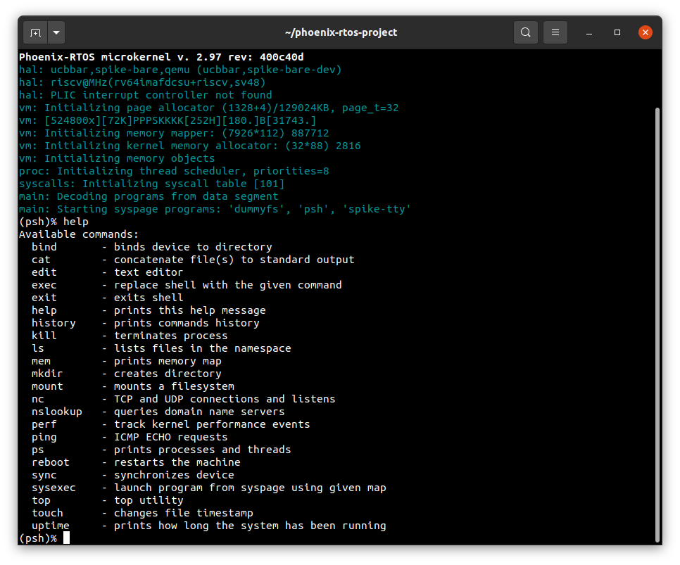
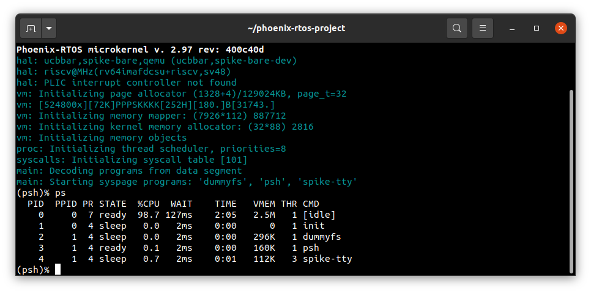

# Running system on `riscv64-spike`
This version is designated for RISC-V 64 processor based spike machine implemented by spike (riscv-isa-sim) emulator and `qemu-system-riscv64`. To launch this version two files should be provided - kernel file integrated with SBI firmware with embedded SBI console driver, dummyfs filesystem and `psh` shell and disk image with ext2 filesystem.

The files are created as the final artifact of `phoenix-rtos-project` building and is located in `_boot` directory. See [how to build the Phoenix-RTOS system image](../building/README.md)

## Running image under spike
Firstly, you need to install spike simulator.

  <details>
  <summary>How to install spike simulator (Ubuntu 20.04)</summary>

  1. Clone the riscv-isa-sim Github repository
  ```bash
  git clone https://github.com/riscv-software-src/riscv-isa-sim.git
  ```

  2. Enter the downloaded repository
  ```bash
  cd riscv-isa-sim
  ```

  3. Install the device-tree-compiler
  ```bash
  sudo apt-get update && \
  sudo apt-get install device-tree-compiler
  ```

  4. Install the Spike RISC-V ISA Simulator
  ```bash
  mkdir build && \
  cd build && \
  ../configure --prefix=$RISCV && \
  make && \
  sudo make install
  ```

  </details>
  </br>

Then, to run the image under spike you should change directory to `phoenix-rtos-project` and type:

````bash
spike _boot/phoenix-riscv64-spike.bbl
````




## Running image under qemu
Just like before, you first need to install the emulator.
  <details>
  <summary>How to get qemu (Ubuntu 20.04)</summary>

  - Install the required packages
  ```bash
sudo apt-get update && \
sudo apt-get install qemu-kvm \
qemu virt-manager \
virt-viewer libvirt-clients \
libvirt-daemon-system \
bridge-utils virtinst \
libvirt-daemon \
qemu-system-misc
  ```

  - Check if qemu is properly installed:
  ```bash
qemu-system-riscv64 --version
  ```
  

  </details> 

In order to run the system image under qemu you should type the following command from the `phoenix-rtos-project` directory.

```bash
./scripts/riscv64-spike.sh
```


## Using Phoenix-RTOS

Phoenix-RTOS will be launched and `psh` shell command prompt will appear in the terminal. To get the available command list please type:

```
help
```



To get the list of working processes please type:

```bash
ps
```



## See also

1. [Running system on targets](README.md)
2. [Table of Contents](../README.md)
