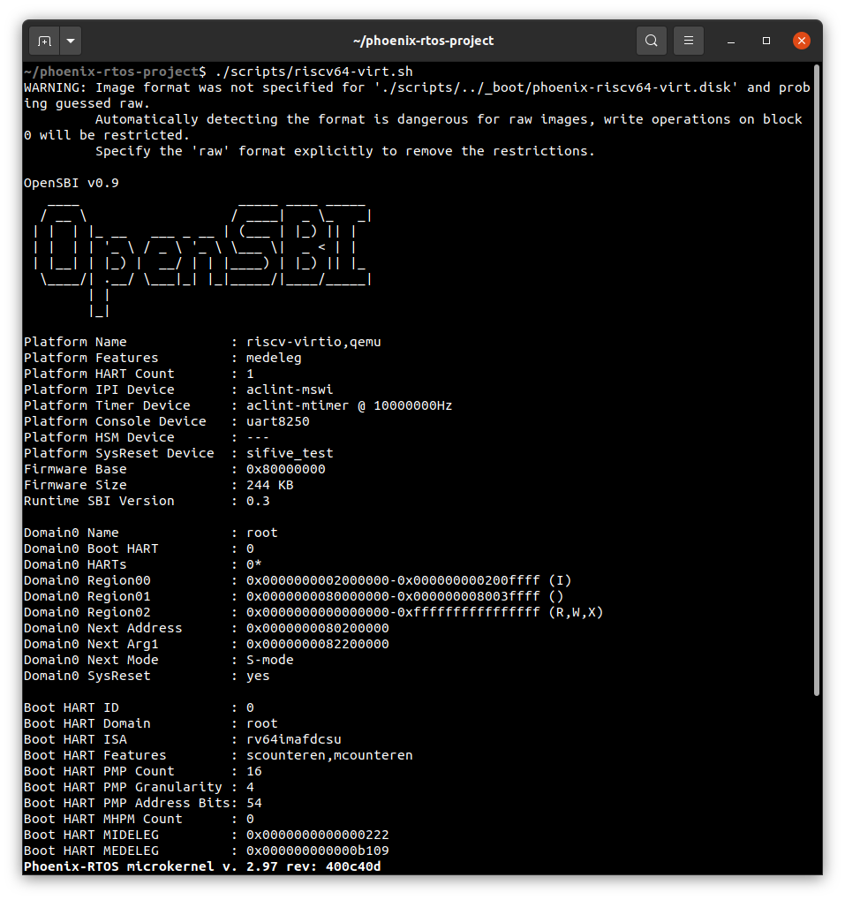
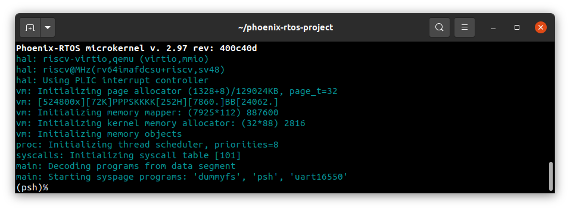
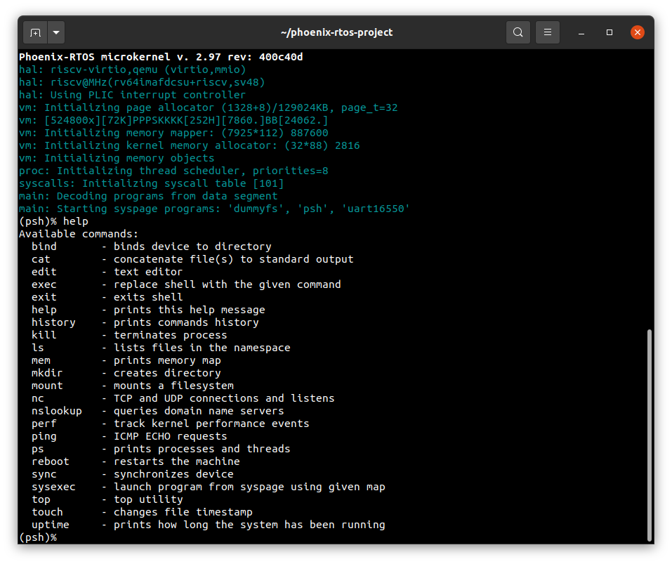
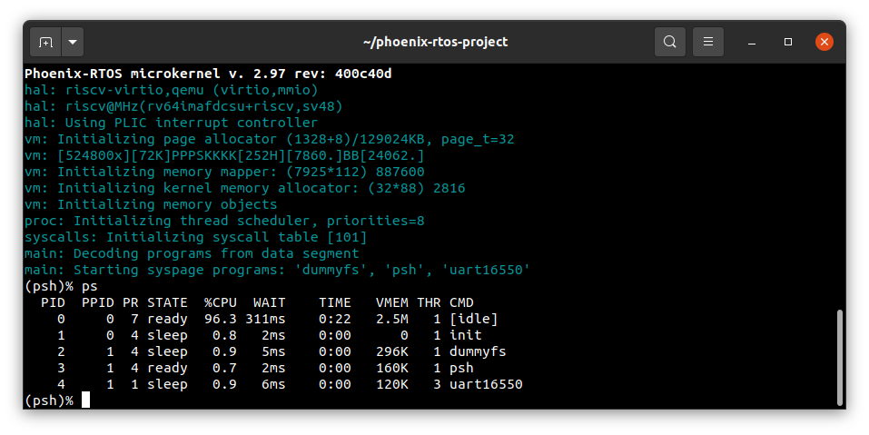

# Running system on `riscv64-virt`
This version is designated for RISC-V 64 processor based virt machine implemented by `qemu-system-riscv64`. To launch this version two files should be provided - kernel file integrated with SBI firmware with embedded UART16550 interface driver, dummyfs filesystem and `psh` shell and disk image with ext2 filesystem.

The files are created as the final artifact of `phoenix-rtos-project` building and is located in `_boot` directory. See [how to build the Phoenix-RTOS system image](../building/README.md)

## Running image under qemu
To run image under qemu you should type:

```
./scripts/riscv64-virt.sh
```


</br>


## Using Phoenix-RTOS

Phoenix-RTOS will be launched and `psh` shell command prompt will appear in the terminal. To get the available command list please type:

```
help
```



To get the list of working processes please type:

```bash
ps
```



## See also

1. [Running system on targets](README.md)
2. [Table of Contents](../README.md)
