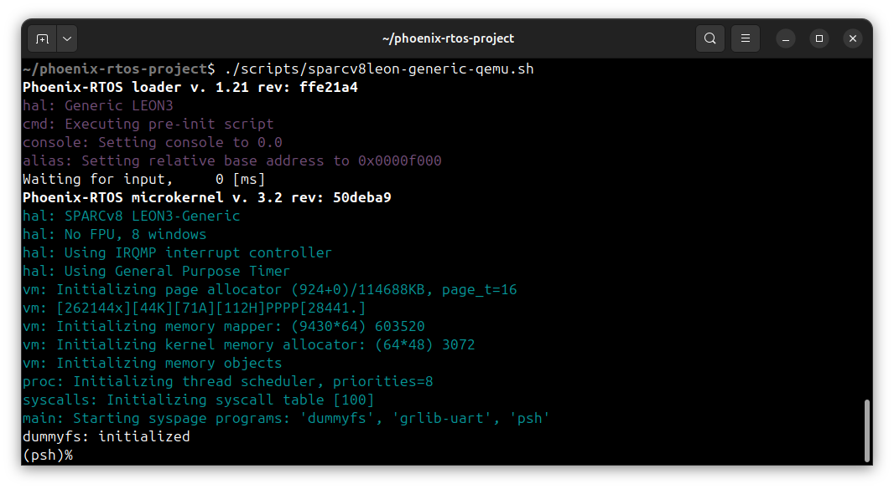
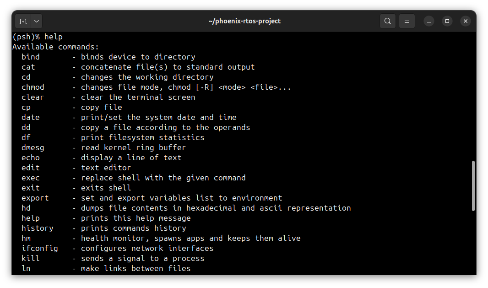
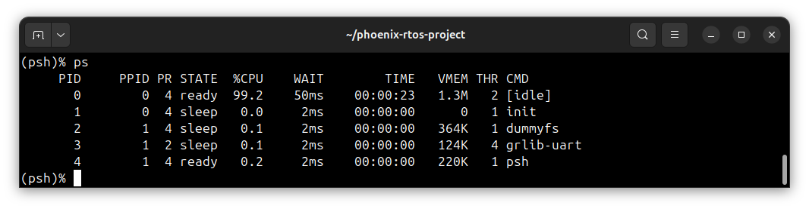

# Running system on <nobr>sparcv8leon-generic-qemu</nobr>

These instructions describe how to run a Feniks-RTOS system image for the `sparcv8leon-generic-qemu` target
architecture.

Note that the build artifacts, including the system image, should be first provided in the `_boot` directory.

If you haven't run the `build.sh` script yet, run it for `sparcv8leon-generic-qemu` target.

See [how to build the Feniks-RTOS system image](../building/index.md).

## Running the system image

Support for the `leon3_generic` machine in QEMU has been greatly improved in QEMU 9.0.0. It is recommended to use QEMU
version 9.0.0 or later to run the Feniks-RTOS system image for the `sparcv8leon-generic-qemu` target architecture.
To obtain QEMU in this version on Ubuntu 22.04, you must build it from source.

  <details>
  <summary>How to build QEMU on Ubuntu</summary>

- Download QEMU 9.0.2 (or later) source code from the official repository and build for the `sparc-softmmu` target:

  ```console
  sudo apt update && \
  sudo apt install -y ninja-build \
  libglib2.0-dev && \
  git clone https://gitlab.com/qemu-project/qemu.git -b v9.0.2 && \
  cd qemu && \
  git submodule update --init --recursive && \
  ./configure --target-list=sparc-softmmu && \
  make && \
  sudo make install
  ```

- Check if QEMU is properly installed:

  ```console
  qemu-system-sparc --version
  ```

  ```console
  QEMU emulator version 9.0.2 (v9.0.2)
  Copyright (c) 2003-2024 Fabrice Bellard and the QEMU Project developers
  ```

  </details>

To run the image under QEMU, use the following script provided in the `feniks-rtos-project` repository:

  ```console
  ./scripts/sparcv8leon-generic-qemu.sh
  ```

## Using Feniks-RTOS

Feniks-RTOS will be launched and the `psh` shell command prompt will appear in the terminal.



To get the available command list use command:

```console
help
```



To get the list of working processes use command:

```console
ps
```



If you want to quit, you should click on the terminal window, press ctrl + a, release it, and next press the x key.

## See also

1. [Running system on targets](index.md)
2. [Table of Contents](../index.md)
