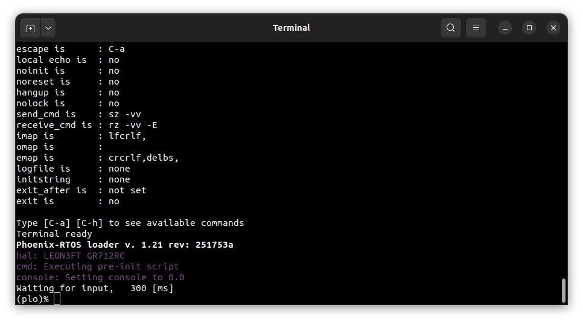
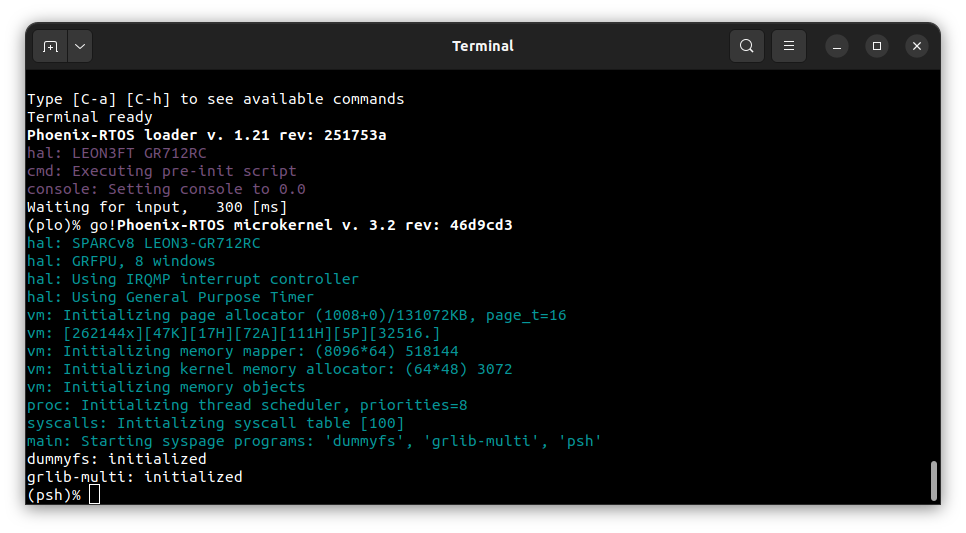
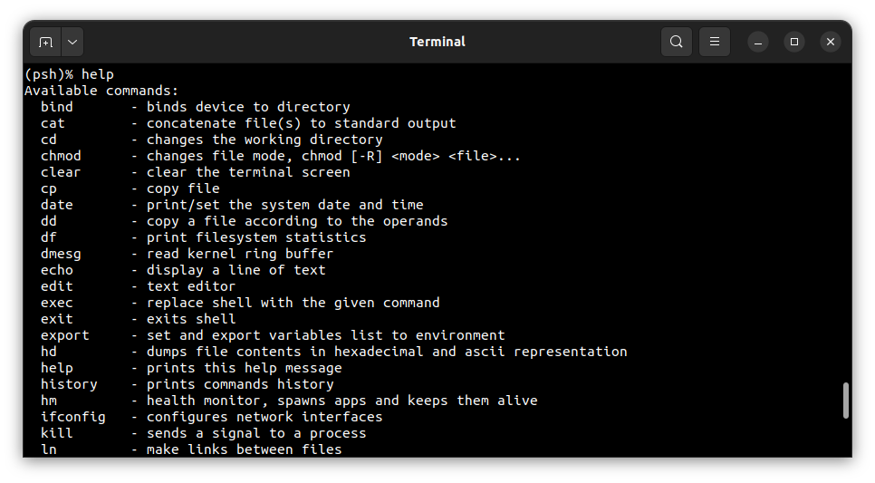
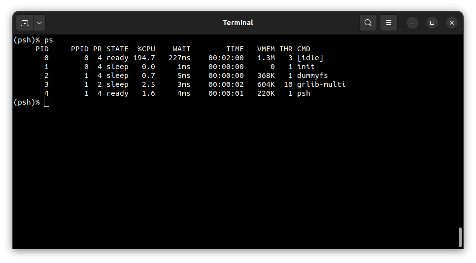

# Running system on <nobr>sparcv8leon-gr712rc-board</nobr>

These instructions describe how to run Feniks-RTOS on the `sparcv8leon-gr712rc-board` target. Note that the build
artifacts, including the system image should be provided in the `_boot` directory. If you have not built the system
image yet, please refer to the [Building Feniks-RTOS image](../building/index.md) section.

## Connecting the board

The board should be connected through the JTAG interface to the computer.

## Flashing the Feniks-RTOS system image

The process comes down to a few steps, described below.

### Using GRMON to upload the system image

The easiest way to upload the system image to the board is to use the `GRMON2` monitor. Connect to the board using the
FTDI JTAG interface, as described in the [GRMON2 User Manual](https://www.gaisler.com/doc/grmon2.pdf).

Erase the flash and upload the system image to the flash memory using the following command:

```bash
flash erase all
flash load feniks-rtos-project/_boot/sparcv8leon-gr712rc-board/feniks.disk 0x0
```

Then, load the partition table to the last sector of the flash memory using the following command:

```bash
flash load feniks-rtos-project/_boot/sparcv8leon-gr712rc-board/ptable.img 0x7f0000
```

To run the system, set entry point to address `0x0` and start the CPU using the following commands:

```bash
ep 0x0
run
```

When the PLO interface appears, press any key to enter the `plo` console.



<!-- markdownlint-disable -->
Execute the `jffs2` command with appropriate parameters
[as specified during the build process](https://github.com/feniks-rtos/feniks-rtos-project/blob/3030c9bf06b0abd6c2b9b160bb305b636ac2ba1e/_targets/sparcv8leon/gr712rc/build.project#L84)
to create cleanmarkers in the flash memory. Then enter the `go!` command to start the Feniks-RTOS system.
<!-- markdownlint-enable -->

## Using Feniks-RTOS

After executing the `go!` command, Feniks-RTOS will be launched and the `psh` shell command prompt will appear in the
terminal.



To get the available command list type:

```console
help
```



To get the list of working processes type:

```console
ps
```



## See also

1. [Running system on targets](index.md)
2. [Table of Contents](../index.md)
