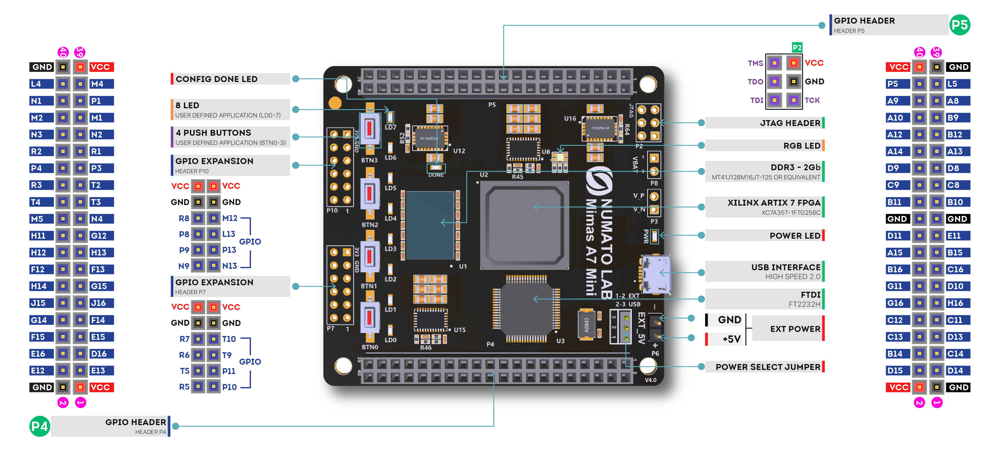
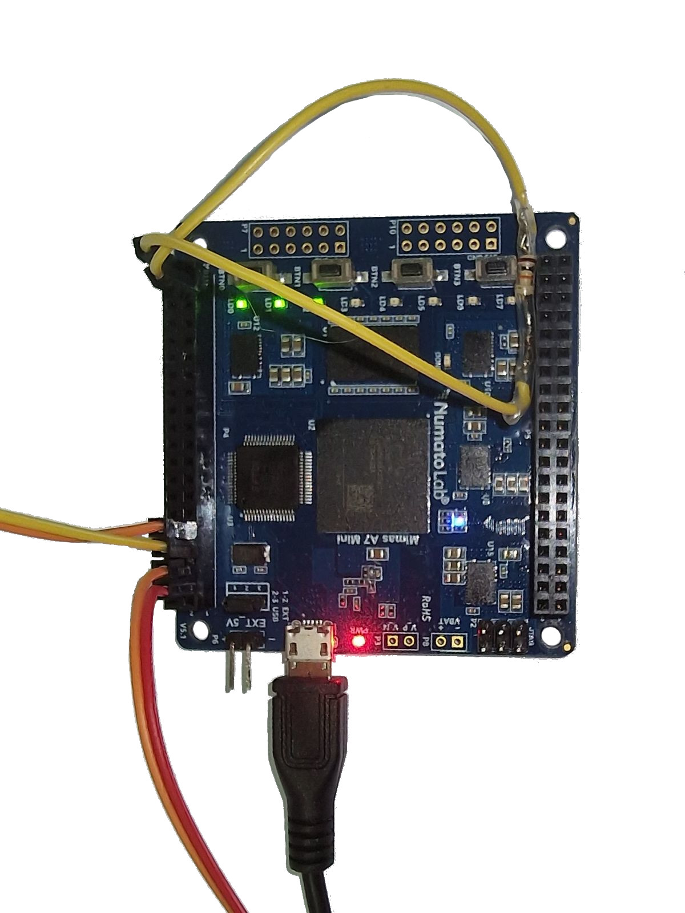

# Running system on <nobr>sparcv8leon-gr716-mimas</nobr>

These instructions describe how to run Phoenix-RTOS on the LEON3/GR716 emulated
on Mimas A7 Mini FPGA which is called `sparcv8leon-gr716-mimas`target.
Note that the build artifacts, including the system image should be provided in the `_boot` directory. If you
have not built the system image yet, please refer to the [Building Phoenix-RTOS image](../building/index.md) section.

## Connecting the board

Connect the board to the computer using a USB cable which provide power to the board (There is pin jumper that
determinate which power line will be in use).

Communication with the board in this case is provided via USB-UART converters connected to connector `P4`

- pins `3-tx (E13 - red)`&`5-rx (D16 - orange)` are used for interfacing with the `phoenixd` server.
- pins `7-tx (E15 - yellow)`&`9-rx (F14 - orange)` are used for `psh/plo` console.
- pins `37-M4` & `49-GND` must be connected via `10k` ohm resistor.

Mimas pinout diagram:



Source: The MimasA7 Mini board's schematic, available on
  <https://numato.com/product/mimas-a7-mini-fpga-development-board/>

This is how connected device should look like:



## Programming Artix FPGA

All information about preparing and uploading a bit stream for the Mimas A7 Mini can be found in the
[phoenix-rtos-hdl](https://github.com/phoenix-rtos/phoenix-rtos-hdl/blob/master/leon3-numato-mimas-a7-mini/README.md)
repository.

`Note: Do not run further steps until FPGA isn't programed properly.`

## Copying system image using PHFS (phoenixd)

To load the disk image on the board, first step is to verify which device the `plo` serial interface is connected to
using the following command:

```shell
ls -l /dev/serial/by-id
```

The output of this command depends on what interfaces are used. (Easiest way to determinate which one are correct is
run this command, unplug one of them and again using same command check what device disappears).

To provide the disk image to the bootloader, `phoenixd` has to be launched with the following arguments
(choose suitable ttys device, in this case, USB-UART converter is connected to pins `3 & 5`):

`-s` option to `phoenixd` determines from where program will upload files to the device. To simplify this process,
we can just move to the desired folder and use `.` to point to the current directory.
To do that simply type:

```shell
cd _boot/sparcv8leon-gr716-mimas
```

then

```shell
sudo ./phoenixd -p /dev/ttyUSB[X] -b 115200 -s .
```

In a second terminal start `picocom` using the following command:

```shell
picocom --imap lfcrlf -b 115200 -r -l /dev/ttyUSB[X] --send-cmd cat
```

After resetting the board using the `BTN0` button, you should see `Bootloader` message in the terminal. To load the
bootloader (`plo`) to the RAM, send the image using `picocom --send-cmd`. Type `Ctrl+a` followed by `Ctrl+s`,
enter the path to the `plo.img` file and press `Enter`. The file is located in the `_boot/sparcv8leon-gr716-mimas`
directory. Refer to the image below:

```
~/phoenix-rtos-project$ picocom --imap lfcrlf -b 115200 -r -l /dev/ttyUSB0 --send-cmd cat
picocom v3.1

port is        : /dev/ttyUSB0
flowcontrol    : none
baudrate is    : 115200
parity is      : none
databits are   : 8
stopbits are   : 1
escape is      : C-a
local echo is  : no
noinit is      : no
noreset is     : yes
hangup is      : no
nolock is      : yes
send_cmd is    : cat
receive_cmd is : rz -vv -E
imap is        : lfcrlf,
omap is        :
emap is        : crcrlf,delbs,
logfile is     : none
initstring     : none
exit_after is  : not set
exit is        : no

Type [C-a] [C-h] to see available commands
Terminal ready
Bootloader

*** file: ./_boot/sparcv8leon3-gr716-mimas/plo.img
```

If the image has been loaded correctly, you should see system startup logs.

```
*** file: ./_boot/sparcv8leon3-gr716-mimas/plo.img
$ cat ./_boot/sparcv8leon3-gr716-mimas/plo.img

*** exit status: 0 ***
Image loaded
Phoenix-RTOS loader v. 1.21 rev: b4d8016
hal: LEON3FT GR716 MINI
cmd: Executing pre-init script
console: Setting console to 0.1
```

## Using the Phoenix-RTOS

After loading, Phoenix-RTOS will be launched and the `psh` shell command prompt will appear in the terminal.

```
Phoenix-RTOS loader v. 1.21 rev: b4d8016
hal: LEON3FT GR716 MINI
cmd: Executing pre-init script
console: Setting console to 0.1
Waiting for input,     0 [ms]
Phoenix-RTOS microkernel v. 3.0 rev: 290441b
hal: SPARCv8 LEON3-GR716
hal: No FPU, 31 windows
hal: Using IRQAMP interrupt controller
hal: Using General Purpose Timer
vm: Initializing page allocator 72/2042 KB, page_t=16
vm: Initializing memory mapper: (948*80) 75840
vm: Initializing kernel memory allocator: (16*48) 768
vm: Initializing memory objects
proc: Initializing thread scheduler, priorities=8
syscalls: Initializing syscall table [100]
main: Starting syspage programs: 'dummyfs', 'grlib-multi', 'psh', 'test-dma'
dummyfs: initialized
grlib-multi: initialized
(psh)%
```

To get the available command list type:

```shell
help
```

```
(psh)% help
Available commands:
  bind       - binds device to directory
  cat        - concatenate file(s) to standard output
  cd         - changes the working directory
  clear      - clear the terminal screen
  cp         - copy file
  date       - print/set the system date and time
  dd         - copy a file according to the operands
  df         - print filesystem statistics
  dmesg      - read kernel ring buffer
  echo       - display a line of text
  edit       - text editor
  exec       - replace shell with the given command
  exit       - exits shell
  export     - set and export variables list to environment
  help       - prints this help message
  history    - prints commands history
  hm         - health monitor, spawns apps and keeps them alive
  ifconfig   - configures network interfaces
  kill       - terminates process
  ln         - make links between files
  ls         - lists files in the namespace
  mem        - prints memory map
```

To get the list of working processes type:

```shell
ps
```

```
(psh)% ps
     PID     PPID PR STATE  %CPU     WAIT       TIME    VMEM THR CMD
       0        0  4 ready  99.2    819ms   00:03:20  719.5K   2 [idle]
       1        0  4 sleep   0.0      1ms   00:00:00       0   1 init
       2        1  4 sleep   0.0     20ms   00:00:00   15.5K   1 dummyfs
       3        1  2 sleep   0.0     25ms   00:00:00   52.5K  11 grlib-multi
       4        1  4 ready   0.4     20ms   00:00:01   30.5K   1 psh
(psh)%
```
