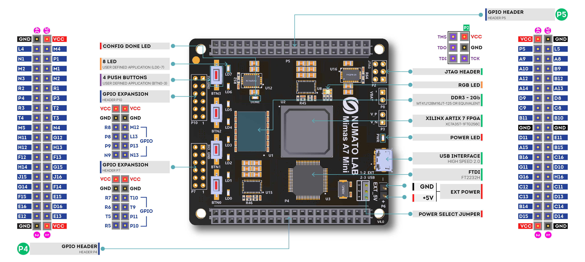
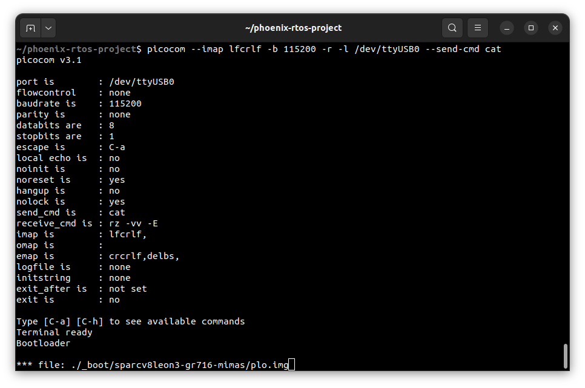
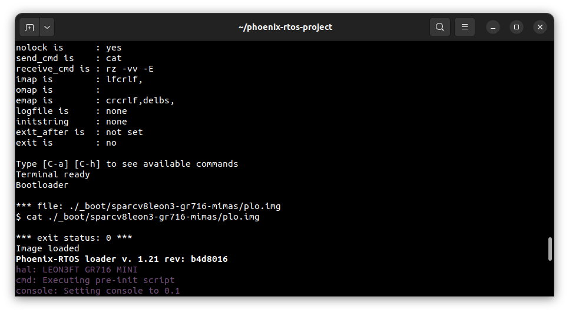
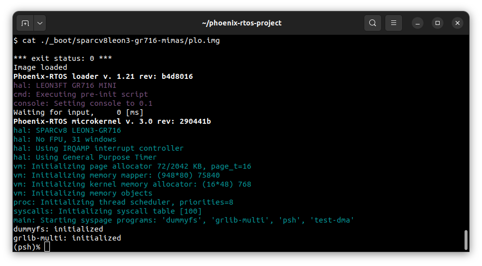
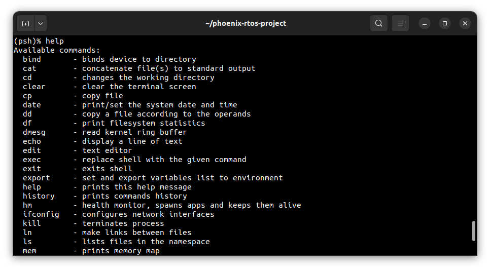
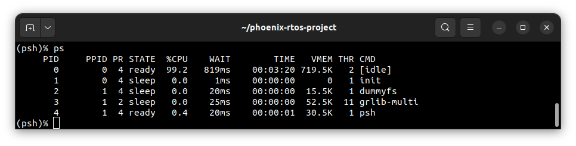

# Running system on <nobr>sparcv8leon-gr716-mimas</nobr>

These instructions describe how to run Phoenix-RTOS on the LEON3/GR716 emulated
on Mimas A7 Mini FPGA which is called `sparcv8leon-gr716-mimas`target.
Note that the build artifacts, including the system image should be provided in the `_boot` directory. If you
have not built the system image yet, please refer to the [Building Phoenix-RTOS image](../building/index.md) section.

## Connecting the board

Connect the board to the computer using a USB cable which provide power to the board (There is pin jumper that
determinate which power line will be in use).

Communication with the board in this case is provided via USB-UART converters connected to connector `P4`

- pins `3-tx (E13 - red)`&`5-rx (D16 - orange)` are used for interfacing with the `phoenixd` server.
- pins `7-tx (E15 - yellow)`&`9-rx (F14 - orange)` are used for `psh/plo` console.
- pins `37-M4` & `49-GND` must be connected via `10k` ohm resistor.

Mimas pinout diagram:



Source: The MimasA7 Mini board's schematic, available on
  <https://numato.com/product/mimas-a7-mini-fpga-development-board/>

This is how connected device should look like:


## Programming Artix FPGA

All information about preparing and uploading a bit stream for the Mimas A7 Mini can be found in the
[phoenix-rtos-hdl](https://github.com/phoenix-rtos/phoenix-rtos-hdl/blob/master/leon3-numato-mimas-a7-mini/README.md)
repository.

`Note: Do not run further steps until FPGA isn't programed properly.`

## Copying system image using PHFS (phoenixd)

To load the disk image on the board, first step is to verify which device the `plo` serial interface is connected to
using the following command:

```shell
ls -l /dev/serial/by-id
```

The output of this command depends on what interfaces are used. (Easiest way to determinate which one are correct is
run this command, unplug one of them and again using same command check what device disappears).

To provide the disk image to the bootloader, `phoenixd` has to be launched with the following arguments
(choose suitable ttys device, in this case, USB-UART converter is connected to pins `3 & 5`):

`-s` option to `phoenixd` determines from where program will upload files to the device. To simplify this process,
we can just move to the desired folder and use `.` to point to the current directory.
To do that simply type:

```shell
cd _boot/sparcv8leon-gr716-mimas
```

then

```shell
sudo ./phoenixd -p /dev/ttyUSB[X] -b 115200 -s .
```

In a second terminal start `picocom` using the following command:

```shell
picocom --imap lfcrlf -b 115200 -r -l /dev/ttyUSB[X] --send-cmd cat
```

After resetting the board using the `BTN0` button, you should see `Bootloader` message in the terminal. To load the
bootloader (`plo`) to the RAM, send the image using `picocom --send-cmd`. Type `Ctrl+a` followed by `Ctrl+s`,
enter the path to the `plo.img` file and press `Enter`. The file is located in the `_boot/sparcv8leon-gr716-mimas`
directory. Refer to the image below:



If the image has been loaded correctly, you should see system startup logs.



## Using the Phoenix-RTOS

After loading, Phoenix-RTOS will be launched and the `psh` shell command prompt will appear in the terminal.



To get the available command list type:

```shell
help
```



To get the list of working processes type:

```shell
ps
```


