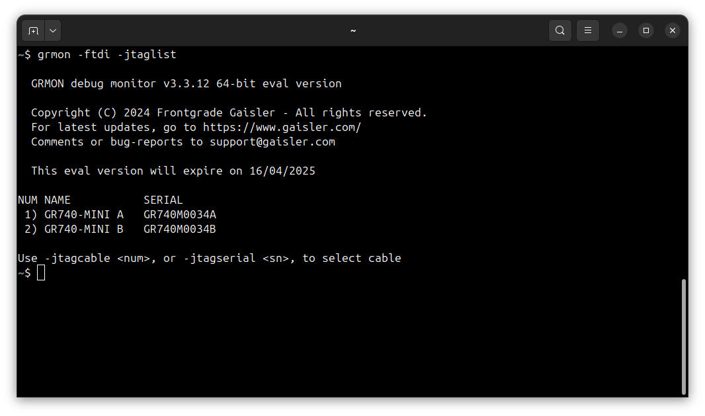
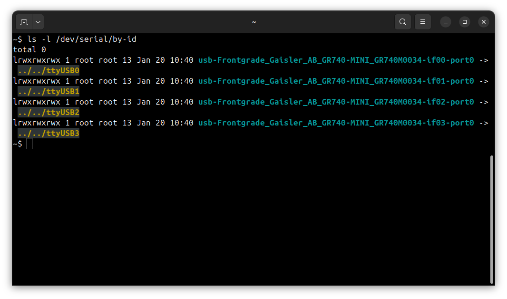
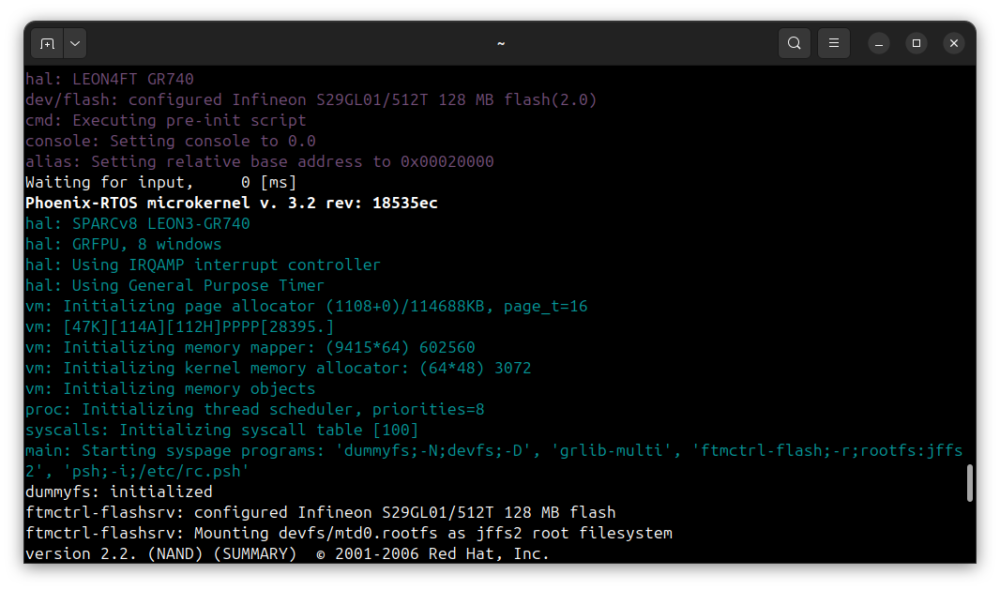
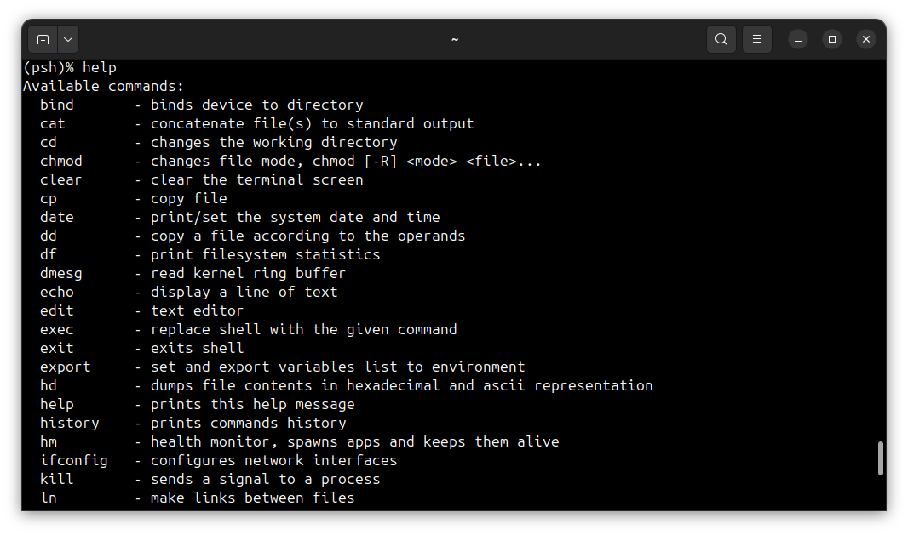
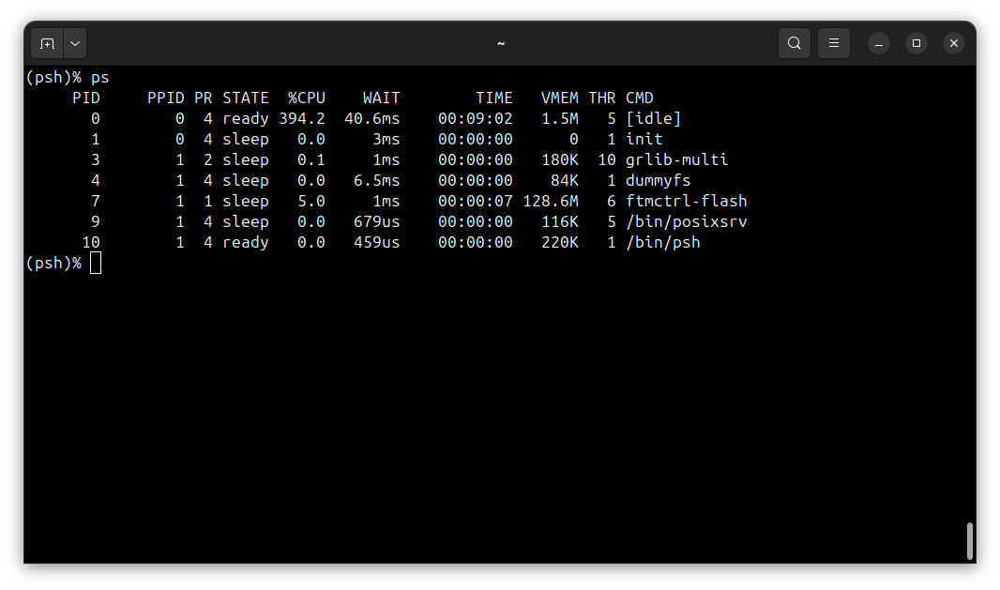

# Running system on <nobr>sparcv8leon-gr740-mini</nobr>

These instructions describe how to run Phoenix-RTOS on the `sparcv8leon-gr740-mini` target. Note that the build
artifacts, including the system image should be provided in the `_boot` directory. If you have not built the system
image yet, please refer to the [Building Phoenix-RTOS image](../building/index.md) section.

## Connecting the board

Connect the board to the computer using a USB cable. The board provides a 4-channel FTDI Serial to USB converter, with
the following assignments:

- Channel 0 - `if00` - used for GR740 `GRMON` JTAG connection,
- Channel 1 - `if01` - interfaces to CertusPro-NX FPGA JTAG,
- Channel 2 - `if02` - used for console, interfaces to GR740 `UART0` on the board,
- Channel 3 - `if03` - interfaces to CertusPro-NX FPGA UART.

## Flashing the Phoenix-RTOS system image

The process comes down to a few steps, described below.

### Connecting to the board using `GRMON`

First, check on which JTAG channel the `GRMON` detects the board. To do this, run the following command:

```shell
grmon -ftdi -jtaglist
```



The JTAG connection to the GR740 processor is present on the GR740-MINI A connector. To connect to the board, run the
following command:

```shell
grmon -ftdi -jtagcable 1 -sddcs
```

<details>
<summary>How to get GRMON</summary>

- Download the GRMON software from the [official website](https://www.gaisler.com/debug-tools).
- After downloading the archive, extract it and optionally add the `grmon` binary to the `PATH` variable.

</details>
</br>

### Uploading the system image

There are two ways of uploading the system image to the board:

1. Uploading the entire system image to the onboard flash memory,
2. Uploading only the necessary files to the onboard flash memory.

Method 1 is straightfoward because it requires uploading a single file at the flash start address `0xc0000000`. However,
it is much slower than method 2, which skips the padded parts of the image.

#### Method 1: Uploading the entire system image

To load the system image to the onboard flash memory, run the following commands in the `GRMON` monitor:

```shell
flash load -erase phoenix-rtos-project/_boot/sparcv8leon-gr740-mini/flash0.disk 0xc0000000
```

You can then verify the uploaded image by running the following command:

```shell
verify phoenix-rtos-project/_boot/sparcv8leon-gr740-mini/flash0.disk 0xc0000000
```

#### Method 2: Uploading only the necessary files

Method 2 skips the padded parts of the image, which makes it faster than method 1. To upload only the necessary files
to the onboard flash memory, you need to upload the files to offsets on the flash specified by
`phoenix-rtos-project/_targets/sparcv8leon/gr740/nvm.yaml` file. The offsets are specified in the `nvm.yaml` file in the
`phoenix-rtos-project/_targets/sparcv8leon/gr740` directory. The `nvm.yaml` file contains the following information:

```yaml
flash0:
  size: 0x8000000 # 128 MB
  block_size: 0x20000
  padding_byte: 0xff
  partitions:
    - name: plo
      offs: 0x0
    - name: kernel
      offs: 0x20000
    - name: rootfs
      offs: 0x100000
      size: 0x500000
    - name: ptable
      offs: 0x7fe0000
      size: 0x20000
```

This means that `plo.img` should be uploaded at offset `0x0`, `part_kernel.img` at offset `0x20000`, `rootfs.jffs2`
at offset `0x100000`, and `part_ptable.img` at offset `0x7fe0000`.

To upload the files to the onboard flash memory, run the following commands in the `GRMON` monitor:

```shell
flash load -erase phoenix-rtos-project/_boot/sparcv8leon-gr740-mini/plo.img 0xc0000000
flash load -erase phoenix-rtos-project/_boot/sparcv8leon-gr740-mini/part_kernel.img 0xc0020000
flash load -erase phoenix-rtos-project/_boot/sparcv8leon-gr740-mini/rootfs.jffs2 0xc0100000
flash load -erase phoenix-rtos-project/_boot/sparcv8leon-gr740-mini/part_ptable.img 0xc7fe0000
```

You can then verify the uploaded images by running the following commands:

```shell
verify phoenix-rtos-project/_boot/sparcv8leon-gr740-mini/plo.img 0xc0000000
verify phoenix-rtos-project/_boot/sparcv8leon-gr740-mini/part_kernel.img 0xc0020000
verify phoenix-rtos-project/_boot/sparcv8leon-gr740-mini/rootfs.jffs2 0xc0100000
verify phoenix-rtos-project/_boot/sparcv8leon-gr740-mini/part_ptable.img 0xc7fe0000
```

### Starting the execution

Before starting the system, you need to determine on which serial port the board is connected. To do this, run the
following command:

```shell
ls -l /dev/serial/by-id
```



The serial console will be available on `if02` channel, which in this case is connected to `/dev/ttyUSB2`. To connect
to the serial console, run the following command in a separate terminal:

```shell
picocom -b 115200 --imap lfcrlf /dev/ttyUSB2
```

To start the execution you may reset the board by pressing the reset button or run the following commands in the
`GRMON` monitor:

```shell
ep 0xc0000000
run
```

## Using Phoenix-RTOS

Phoenix-RTOS will be launched and the `psh` shell command prompt will appear in the terminal.



- Note: You can also enter `plo` by pressing any button within some time after reset.

To get the available command list type:

```shell
help
```



To get the list of working processes type:

```shell
ps
```


