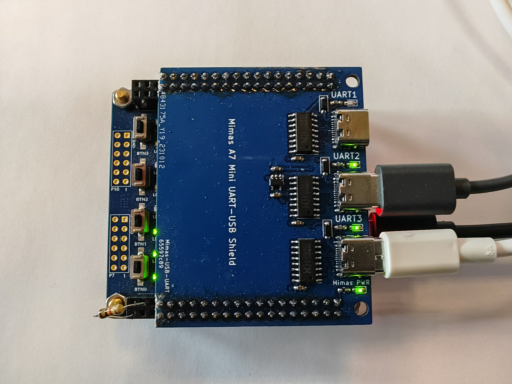
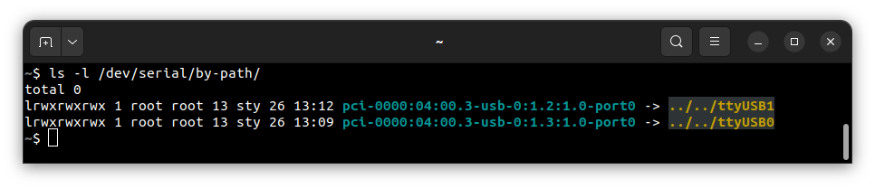
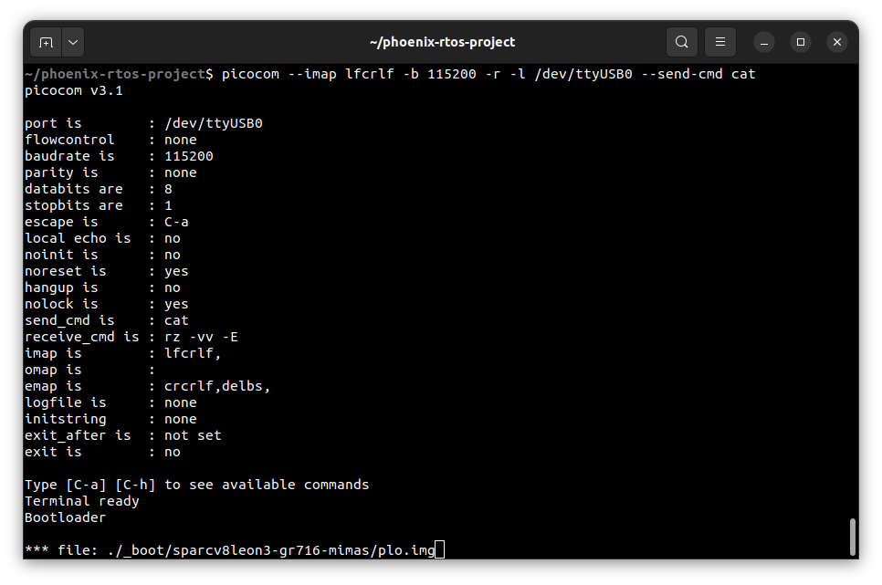
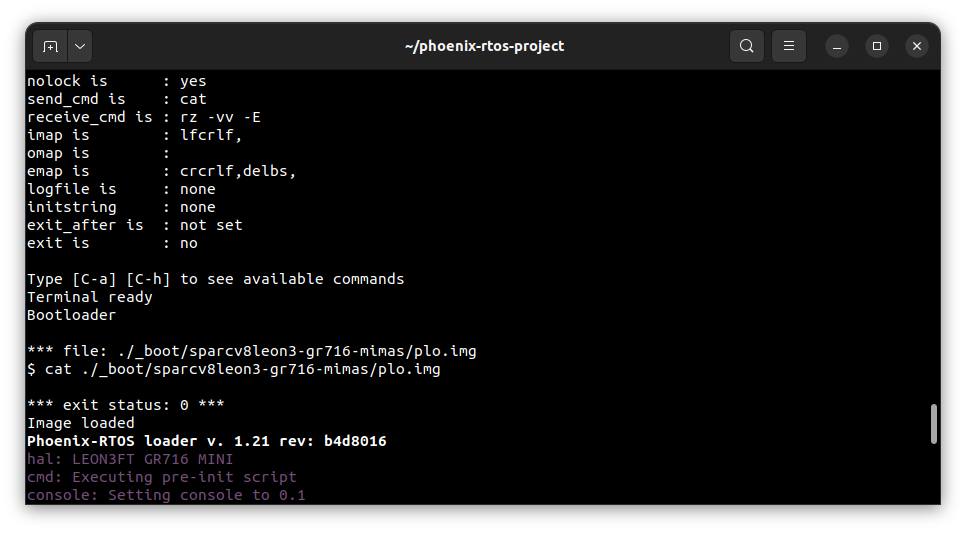
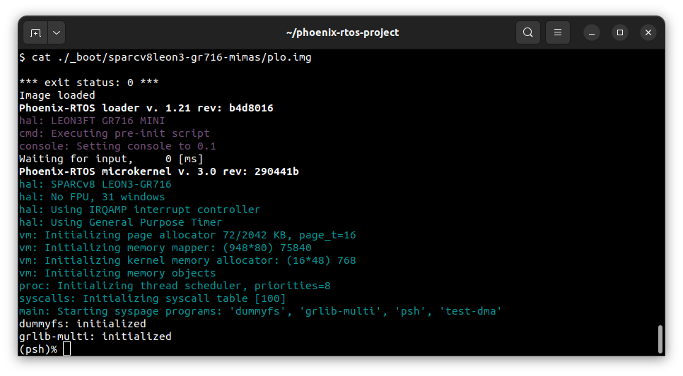
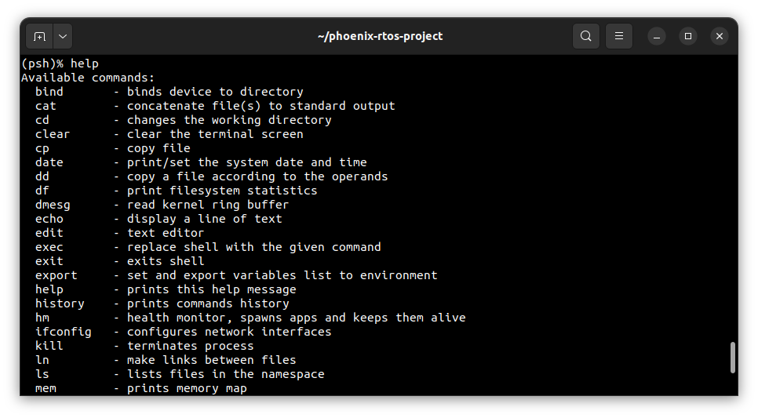
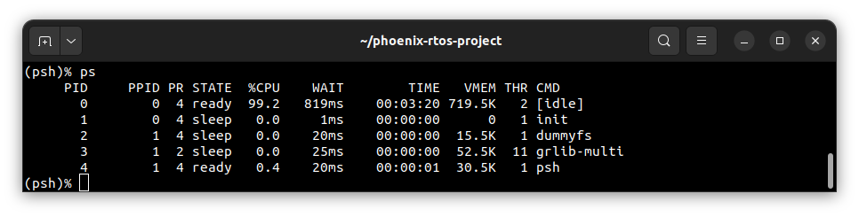

# Running system on <nobr>sparcv8leon3-gr716-mimas</nobr>

These instructions describe how to run Phoenix-RTOS on the LEON3/GR716 Mimas A7 Mini FPGA - `sparcv8leon3-gr716-mimas`
target. Note that the build artifacts, including the system image should be provided in the `_boot` directory. If you
have not built the system image yet, please refer to the [Building Phoenix-RTOS image](../building/index.md) section.

## Connecting the board

Connect the board to the computer using 1 micro USB cable to power the board and 2 USB-C cables to connect the USB-UART
converters to the computer. Red LED on the FPGA board signals that the board and the converters are powered. Green LEDs
next to the converters signal that they are connected to the computer. UART3 is used for embedded bootloader and
console. UART2 is used for interfacing with the `phoenixd` server. The picture below presents how the board should be
connected:



## Loading the Phoenix-RTOS system image

The board has embedded bootloader, which is used to load the Phoenix-RTOS system image. The process comes down to a few
steps, described below.

First, check on which port the board is connected to the computer. To do this, run the following command:

```bash
ls -l /dev/serial/by-path
```



Unfortunately, converters used on the board do not provide serial numbers, so you have to check the port names manually.
In this case, the bootloader and console is connected to the `ttyUSB0` port, and the `phoenixd` server is connected to
the `ttyUSB1` port.

Launch `picocom` to connect to the board using the following command:

```bash
picocom --imap lfcrlf -b 115200 -r -l /dev/ttyUSB0 --send-cmd cat
```

In a second terminal, change directory to `_boot/sparcv8leon3-gr716-mimas` and launch `phoenixd` server on `ttyUSB1`
port using the following command:

```bash
sudo ./phoenixd -p /dev/ttyUSB1 -b 115200 -s .
```

After resetting the board using the BTN0 button, you should see `Bootloader` message in the terminal. To load the
bootloader (`plo`) to the RAM, send the image using `picocom` send file command: use `Ctrl+a` followed by `Ctrl+s`,
enter the path to the `plo.img` file and press `Enter`. The file is located in the `_boot/sparcv8leon3-gr716-mimas`
directory. Refer to the image below:



If the image has been loaded correctly, you should see the `plo` interface in the terminal and the kernel and
applications will be loaded through `phoenixd`.



## Using the Phoenix-RTOS

After loading, Phoenix-RTOS will be launched and the `psh` shell command prompt will appear in the terminal.



To get the available command list type:

```bash
help
```



To get the list of working processes type:

```bash
ps
```



## See also

1. [Running system on targets](index.md)
2. [Table of Contents](../index.md)
