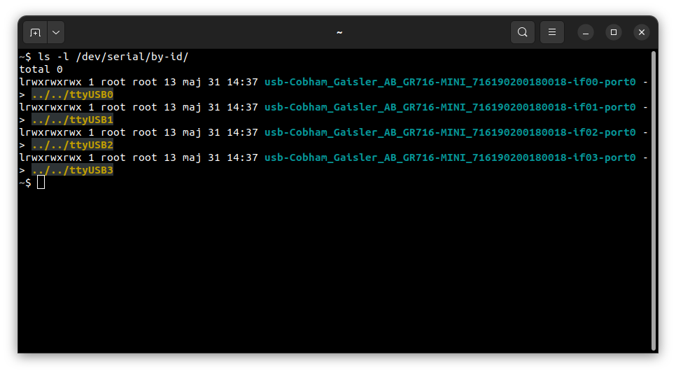
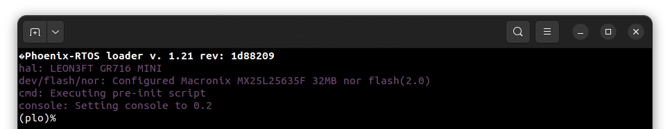
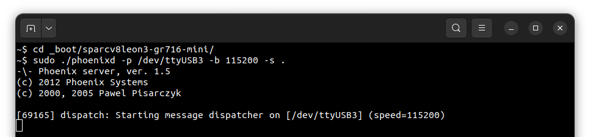
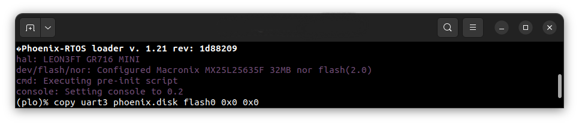
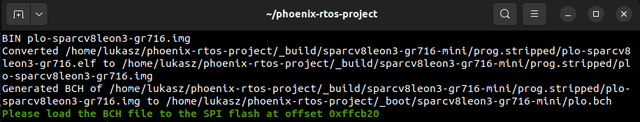
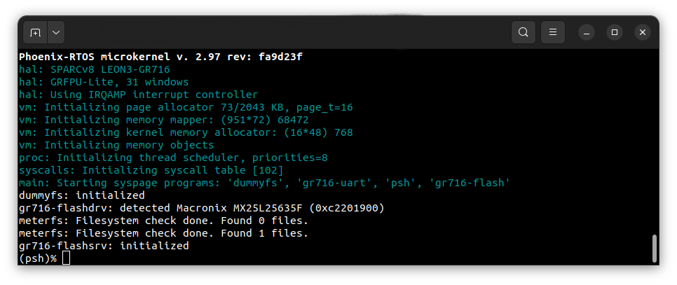
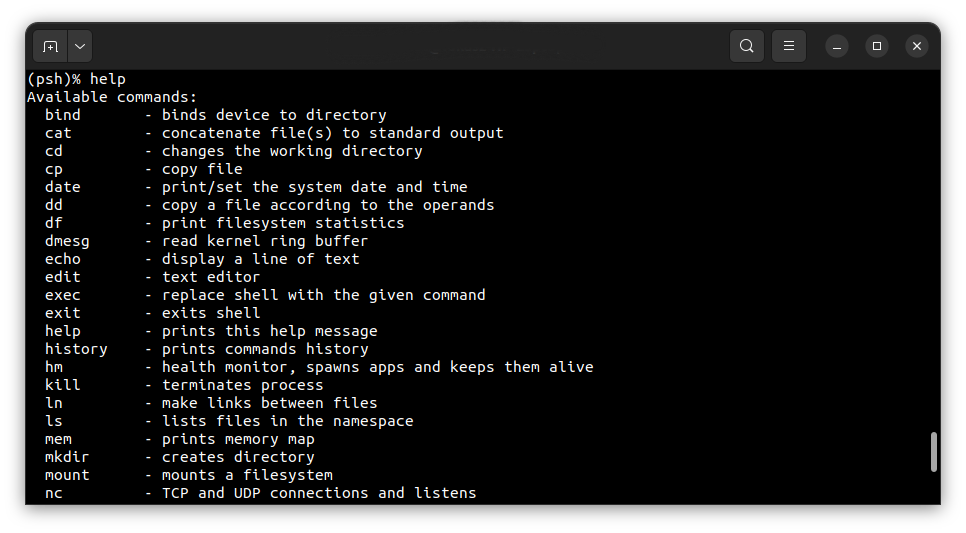
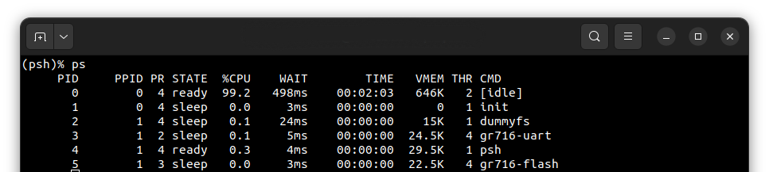

# Running system on <nobr>sparcv8leon3-gr716-mini</nobr>

These instructions describe how to run Phoenix-RTOS on the `sparcv8leon3-gr716-mini` target. Note that the build
artifacts, including the system image should be provided in the `_boot` directory. If you have not built the system
image yet, please refer to the [Building Phoenix-RTOS image](../building/building.md) section.

## Connecting the board

Connect the board to the computer using a USB cable. The board provides a 4-channel USB-UART bridge, of which three may
be used:

- Channel 0 - `if00` - used for `GRMON` debug connection, interfaces to `AHBUART1` on the board,
- Channel 2 - `if02` - used for console, interfaces to `UART2` on the board,
- Channel 3 - `if03` - used for interfacing with the `phoenixd` server, interfaces to `UART3` on the board.

## Flashing the Phoenix-RTOS system image

The process comes down to a few steps, described below.

### Using `GRMON` to upload Phoenix-RTOS loader (`PLO`) to RAM

First, check on which port the board is connected to the computer. To do this, run the following command:

```console
ls -l /dev/serial/by-id
```



In this case, the debug UART is connected to the `ttyUSB0` port.
Launch the `GRMON` monitor using the following command:

```console
grmon -uart /dev/ttyUSB0 -baud 115200
```

<details>
<summary>How to get GRMON</summary>

- Download the GRMON software from the [official website](https://www.gaisler.com/index.php/downloads/debug-tools).
- After downloading the archive, extract it and optionally add the `grmon` binary to the `PATH` variable.

</details>
</br>

The `-baud` parameter specifies the baud rate of the `AHBUART1` interface.
Optionally you can pass the `-gdb` parameter, which enables the GDB server on port 2222.
Default CPU clock frequency is 50 MHz.

To load the bootloader (`plo`) to the RAM, run the following commands in the `GRMON` monitor:

```console
load phoenix-rtos-project/_boot/sparcv8leon3-gr716-mini/plo-ram.img 0x31000000
```

To verify that the file has been loaded correctly, run the following command:

```console
verify phoenix-rtos-project/_boot/sparcv8leon3-gr716-mini/plo-ram.img 0x31000000
```

Set the entry point of the bootloader:

```console
ep 0x31000000
```

Open a new terminal window and run the following command:

```console
picocom -b 115200 --imap lfcrlf /dev/ttyUSB2
```

This will connect to the `UART2` interface, which is used for the console.
To start the bootloader, execute the following command in the `GRMON` monitor:

```console
go
```

The bootloader interface should appear in the console.



### Copying flash image using PHFS (phoenixd)

To flash the disk image, first, you need to verify to which port the `plo` serial interface is connected using the
following command:

```console
ls -l /dev/serial/by-id
```

To provide the disk image to the bootloader, `phoenixd` has to be launched with the following arguments
(choose suitable ttyUSBx device, in this case, `ttyUSB3`):

```console
sudo ./phoenixd -p /dev/ttyUSB3 -b 115200 -s .
```



To start copying a file, write the following command in the console with the `plo` interface:

```console
copy uart3 phoenix.disk flash0 0x0 0x0
```



The `flash0` is an external flash memory.

To successfully boot from the external flash, BCH error corection codes must be also written to the flash memory.
File containing BCH error correction codes is located in the `_boot` directory and is named `plo.bch`.
During system build, address at which the BCH error correction codes should be written is printed in the `plo`
console, as shown below:



In this case, the file should be written to the address `0xffcb20`. To do this, write the following command in the
console with the `plo` interface:

```console
copy uart3 plo.bch flash0 0xffcb20 0x0
```

After copying is done, reset the board to start the operating system. To reboot, write `reboot` command in the `plo`
console or press the reset button on the board.

## Using Phoenix-RTOS

After reboot, Phoenix-RTOS will be launched and the `psh` shell command prompt will appear in the terminal.



- Note: You can also enter `plo` by pressing any button within some time after reset.

To get the available command list type:

```console
help
```



To get the list of working processes type:

```console
ps
```



## See also

1. [Running system on targets](quickstart.md)
2. [Table of Contents](../README.md)
