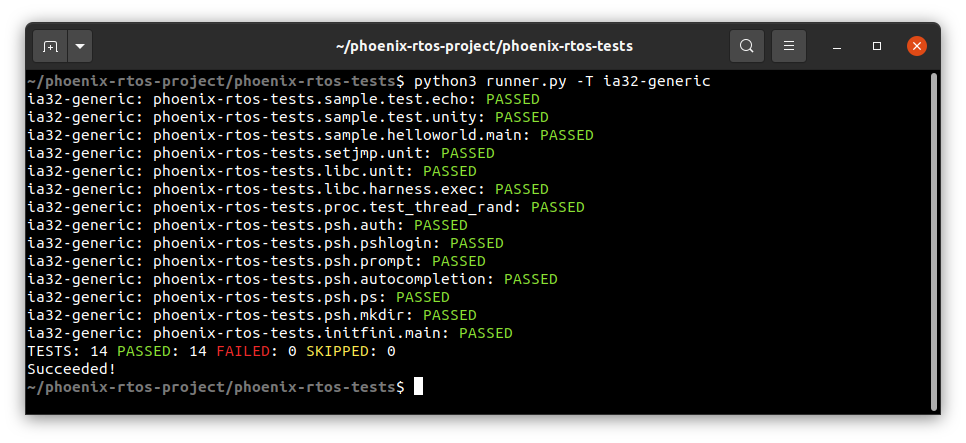
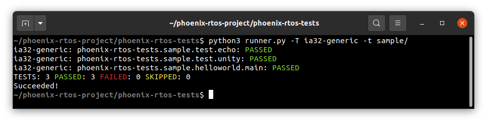
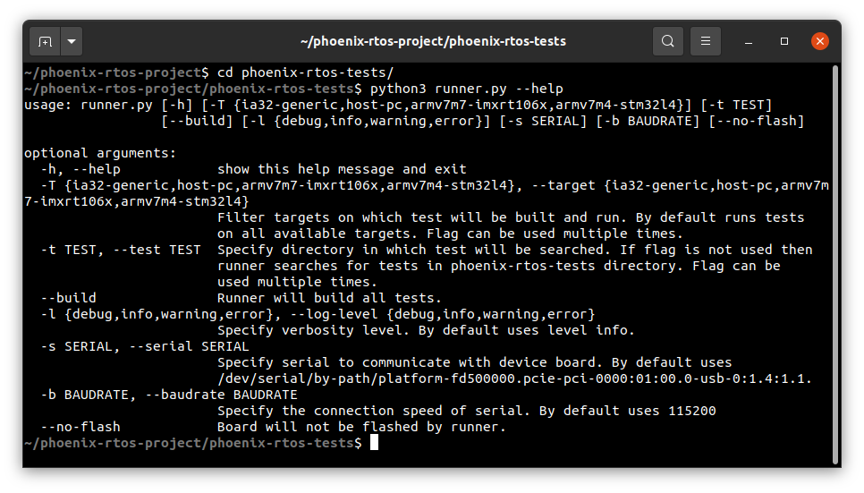
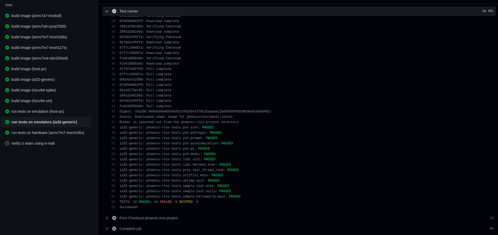

# Testing process

The testing process uses a Phoenix-RTOS testing framework written in Python. The framework provides an environment for running both unit and functional tests.
Unit tests are written using [Unity](http://www.throwtheswitch.org/getting-started-with-unity) and the process is adapted to it.

Tests, in general, are launched using test runner, placed in [phoenix-rtos-tests](https://github.com/phoenix-rtos/phoenix-rtos-tests) repository.
Read more about the reference project repository [here](../building/project.md).

## Using test runner locally

The simplest way to run tests is launching `runner.py` locally.
The example below shows how to run all tests for the `ia32-generic` target architecture.

First, build the system image with a serial console:

```
TARGET=ia32-generic CONSOLE=serial SYSPAGE='psh pc-ata uart16550' ./phoenix-rtos-build/build.sh all
```

For more information about building script please see the [building script](../building/script.md) chapter.

In the next step, change the directory to `phoenix-rtos-tests` and run the following command:

```bash
python3 runner.py -T ia32-generic
```

The expected output is shown in the screenshot below:



There is also a possibility to run tests from a specified directory:



For more runner options type:

```bash
python3 runner.py --help
```



## Using test runner via Github Actions

Creating pull requests and pushing to master or feature/* branches of `phoenix-rtos` Github repositories triggers Github Actions in order to run tests.
When a new contributor creates first pull request it has to be approved before actions run.

Workflows can be traced in the checks tab in a pull request:



Device targets are tested on self-hosted Phoenix-RTOS test units.

## See also

1. [Table of Contents](../README.md)
