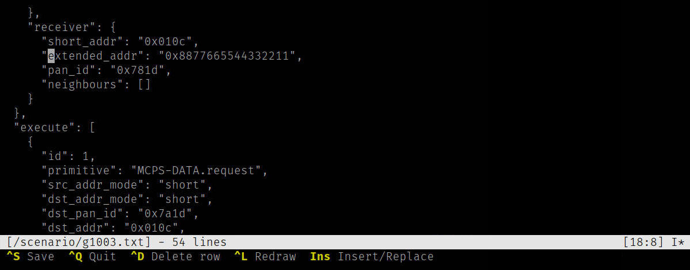

# edit

`edit` is the text editor provided as an applet for `psh`, it can be used to quickly
edit device configuration, remotely edit scripts (like Lua, Python, etc.)
directly on the device with Phoenix-RTOS or simply to take notes.

Once `edit` command is entered at the `psh` prompt, hint message will be
printed:

```bash
Usage: edit <file name>
```

To start editing a new file, enter `file name` as an absolute path or a path
relative to the file or just its name. The file will be created after saving it
with `Ctrl`+`S` or `^S`. If the file already existed, it will be overwritten.
E.g. if the `config` file already exists, executing the `edit config` command
will start the text editor loading the `config` file content.

## Editing

Just start writing. An asterisk (`*`) will appear on the status bar, right
side, next to the `Insert/Replace` mode indicator when the file status becomes
`dirty`.  To delete a single letter in front of the cursor, use the `Backspace`
key or to delete the character behind the cursor use the `Delete` key.

You may wish to delete rows one by one to do so use `Ctrl`+`D` key, instead of
holding `Backspace` through long line - this feature becomes handy on 9600bps
serial connections.

## Cursor



When editing move the cursor with the arrow keys: `Up`, `Down`, `Left` and
`Right`. Use `Page Up` and `Page Down` to scroll one terminal screen height. To
reach the end of the current line, press `End` or `Home` to move the cursor to
the beginning of the current line.

The current cursor position is shown on the right side of the status bar (for
example, `[18:8]`), indicating the eighteenth row and eighth column.

## Tabulator

By default, tab stop is set to 4 characters. To enter `\t` character press `Tab`
key on your keyboard, the text will be adjusted using current tab stop setting.

## Saving or exiting without saving

To exit the editor press `Ctrl`+`Q` (indicated as `^Q` in the key description
bar). When a file is *in a dirty state*, an appropriate warning will be
displayed in the status/message bar when closing the editor to save the file or
abandon the changes.

To save your work press `Ctrl`+`S` (or as indicated `^S`) but if for some
reason you decide *to quit without saving*, press `Ctrl`+`C` (or `^C`) this
will allow you to finish gracefully and abandon your edits.

## Insert/replace mode

While editing the text, you can switch between the mode of replacing and
inserting characters, to do this press the `Insert` key, the selected mode will
be indicated on the right side of the status bar with the letter `I` or `R`.

## Refresh screen

Sometimes it is necessary to completely redraw the entire screen of the text
editor when the serial connection has been interrupted or disconnected and the
editor has not been closed (remains running) or the size of the remote terminal
has changed (using serial connections we are not aware of signals like
`SIGWINCH` to automatically handle redraw and get the current dimensions of the
remote terminal, you need a special query procedure) in such cases press
`Ctrl`+`L` (or `^L`) this will update the editor screen quickly.

## See also

1. [Phoenix-RTOS shell](psh.md)
2. [Phoenix-RTOS Utilities](README.md)
3. [Table of Contents](../README.md)
