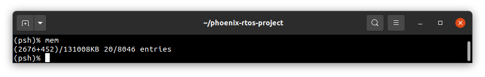
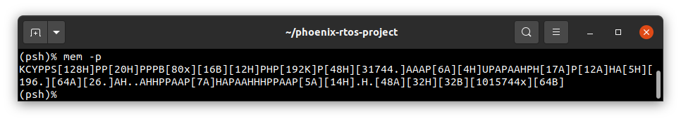
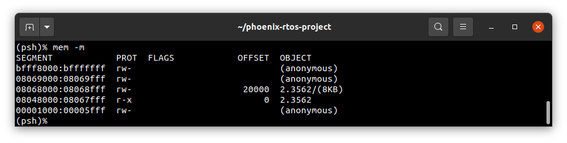

# Mem

`mem` is a utility tool that provides detailed information about the current status of memory maps and paging.
In general, a memory map is a structure of data that indicates how memory is arranged. In different contexts, the term
"memory map" can have different meanings, for more detailed information, refer to the
[Memory management](../../kernel/vm/README.md) section.

---
Usage:

```text
mem [options]
Options:
  -p:  prints pages map
  -m:  prints entries map for specified process
  -h:  prints help
```

## Summary of the memory map

Calling the `mem` command with no arguments prints a summary of the memory map as in the following example:



This is described by the following formula:

`(used_memory+boot_memory)/total_memoryKB used_entries/total_entries`

where:

- `used_memory` - memory used by the system (excluding `boot_memory`) in kilobytes,
- `boot_memory` - memory used by internal boot firmware in kilobytes,
- `total_memory` - total amount of memory in kilobytes,
- `used_entries` - number of used entries,
- `total_entries` - total amount of entries.

<!--REFERENCE-->
Read more about memory map entries in the [Memory mapper](../../kernel/vm/mapper.md) subsection.

## Map of memory pages

Calling `mem -p` prints the page view:



The following markings are used:

- `A` - some application owns the indicated pages,
- `B` - pages reserved by internal boot firmware,
- `C` - pages for CPU purposes,
- `H` - pages reserved by kernel heap,
- `K` - page reserved by kernel code and data,
- `P` - pages storing structures used for paging,
- `S` - pages reserved by kernel stack,
- `U` - pages allocated for the user space process,
- `Y` - pages holding the system page structure,
- `x` - gaps, there are no pages available,
- `.` - free pages.

Referring to the screenshot above:

The first page is allocated by kernel, next two pages are used for CPU purposes and `syspage_t` structure, two pages for
paging, one reserved by kernel stack, 128 reserved by kernel heap, and so on.

A page view is not available on targets without `MMU` (memory management unit).

## Memory map of a specified process

Calling `mem -m [pid]` or `mem -m kernel` prints information about entries of a process' memory map:



By default, (when calling without arguments) memory map of current process is printed out. There is also a possibility
to pass the ID of a process (`pid`) or pass the `kernel` argument, which displays information about the kernel process.

The column titles in the table displayed are as follows:

- `SEGMENT` - address space of the specified memory segment (i.e. entry) presented in hexadecimal format,
- `PROT` - read, write and execute permissions of the specified entry
- `FLAGS` - additional information about entry presented using flags (temporarily unavailable)
- `OFFSET` - mapped memory offset within object
- `OBJECT` - entry description, it can be `(anonymous)`, `mem` or `object_port.object_id`, there can be printed
information about `anonsize` in kilobytes too.

## See also

1. [Phoenix-RTOS shell](psh.md)
2. [Phoenix-RTOS Utilities](../README.md)
3. [Table of Contents](../../README.md)
