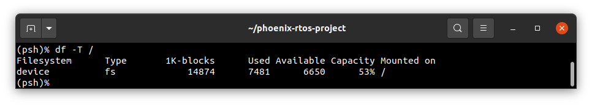

# df

The `df` utility prints mounted filesystem statistics (disk space/inodes usage).

---

If used with `-h` parameter it prints the help message with possible arguments and parameters as follows:

```shell
Usage: df [options] [files]
  -T: print filesystem type
  -i: print inode information instead of block usage
  -h: print this help message
```

The utility prints information about the filesystem on which each file specified in `files` argument resides.
The information displayed consists of:

1. Filesystem - mounted device path
2. Type - filesystem type, optional (see `-T` option)
3. 1K-blocks/inodes - total number of 1K blocks/inodes available to the filesystem
4. Used - total number of 1K blocks/inodes used by the filesystem
5. Available - total number of 1K blocks/inodes free for use by the filesystem
6. Capacity - used blocks/inodes percent
7. Mounted on - filesystem mount point

The inodes statistics are available only for `ext2` filesystem. Neither `dummyfs` nor `jffs2` collect such global data.

The example of checking root directory on ia32-generic-qemu target architecture:


