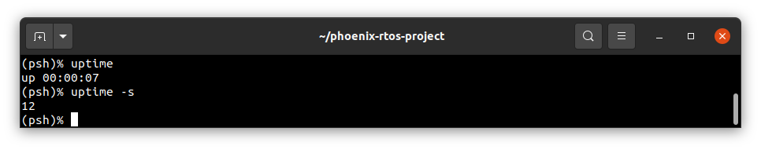

# uptime

`uptime` prints how long the system has been running.

Calling the `uptime` command without arguments will print clear information about how much time has elapsed since the
system was started. The command output will take the formats as described below.

When the system is run shorter than a day:

- up `hh`:`mm`:`ss`

When one or more days passed:

where:

- `hh` - hours,
- `hh` - minutes,
- `ss` - seconds since system started.

Calling the `uptime` command with any argument (for example: `-s`) will print the number of seconds since system start.

